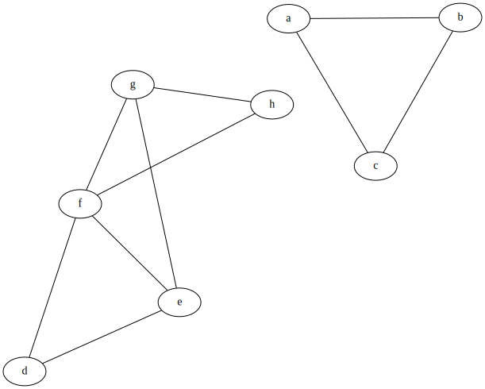

\pagebreak

# Abstract

Peer grading is an increasingly popular way to grade students' work, especially in MOOCs (Massive Open Online Courses). As the size of classes increases, course instructors may not be able to mark all of the work. To solve this problem we can introduce peer grading. The idea is that each student grades the work of a subset of the total population excluding their own.

The most common way to do this is to employ cardinal peer grading. This is where students mark the work of other students and assign them a numerical score which is then used to estimate the student's actual score. The issue with this is that students may mark inaccurately or mark maliciously to inflate their grades.

To avoid the latter, we can use ordinal peer grading. Students are given a set of papers and are asked to give an ordered ranking of all the papers from best to worst. From this information, we can obtain a ranking of students or estimate the student's scores. One problem with this may be that ranking can be difficult when presented with many choices.

In this project, we'll be exploring pairwise grading. Students are given a set of papers. The set is split off into pairs and the student compares the papers in these pairs. For example, given the set of papers, $P_{1}, P_{2}, P_{3}, P_{4} \dots P_{n}$ the student may be asked to compare $P_{1}$ vs $P_{2}$ $P_{3}$ vs $P_{4} \dots P_{n-1}$ vs $P_{n}$ and from this information we'll obtain a ranking of students or estimate the student's score.

We want to give more weight to students that do better as they're more likely to recognise good work. However, we do not know who these students are until we give them a ranking making this a challenging problem.

We'll also be exploring the distribution of the papers, we don't want to overwhelm the students with many papers to rank, so the subsets cannot be too large. However, that means that we may be left with incomplete rankings. Fairness is also a key aspect of this project, we want to ensure that the workload is distributed evenly across students.

# Background

Ranking alternatives by aggregating preferences falls under the problem of social choice.

In this case, the alternatives are the students and the preferences are the comparisons that the students make between the papers. Social choice theory shows up in several contexts. For example: 

- Elections, we need to rank politicians based on the preferences of voters.
- Online shopping recommendations, we need to rank products based on reviews, user profiles and other metrics. 
- Sports/Online games, we need to rank players or teams based on the outcome of matches. 

Various voting rules have been defined, which take the voter's ballot as input and produces a single ranking as output.

Many different voting rules can be used, such as majority rule, plurality rule, or the Borda count. However, each voting rule has its advantages and disadvantages, and no voting rule is universally optimal for all situations.

This third application is similar to our problem. Given a sports tournament where every team plays every other team. A round-robin tournament graph or a complete graph can be formed. It would be directed, and an edge from one node to another would indicate that one team beat the other.

Of course, just because a team beat another doesn't necessarily mean that a team is better, they could've been lucky and achieved an upset. Another problem with getting the results are cycles in the tournament. Let's say 3 teams participate in a basketball tournament. 

- Team 1 beat Team 2
- Team 2 beat Team 3
- Team 3 beat Team 1

In this case, we get a cycle and it is unclear which team is the best. If the tournament was acyclic, then we can apply topological sorting to get a total order and a ranking of the teams.

Various approaches such as have been used to solve this ranking problem. One survey [@gonzalez-diaz_paired_2014] has analysed Scores, Maximum Likelihood, Fair Bets, Least Squares, Recursive Bucholz and Generalised row sum methods to approach the problem.  

Another perspective on this is that the tournament is made up of edges where each edge has a chance of being wrong (an upset occurred). Taking this view we can try to flip edges until we make the tournament acyclic. This is closely related to the Kemeny ranking [@kenyon-mathieu_how_2007] method we use in section 6.4.

Our project can be viewed as a variation of this concept. In sports, upsets can occur due to various external factors, leading to "noise" in the outcome. However, in our project, the "noise" is localised in the peer grader making the pairwise comparison.

The other part of this project is matchup distribution. We can think of matchup distribution as assigning judges to matches. However, the pool of judges that we can pick from is also the pool of participants. This brings us to the problem of fair assignment. We don't want to assign a judge to their own match, and we must ensure that the number of matches each judge is assigned is fairly equal. To solve this we can look to the problem of edge colouring.

Edge Colouring is a graph colouring problem in which the edges of a graph are given a colour. In our case, we also give the nodes a colour. The colouring rules are that a coloured edge may not be incident to a node of the same colour and that for every pair of colours, the number of edges assigned to both colours cannot differ by more than one. This also has applications outside of this project, for example, it's used in register allocation for CPUs, scheduling problems and channel allocation in networks.

## Previous work

### Cardinal ranking

CrowdGrader is [@de_alfaro_crowdgrader_2013] an algorithm that would aggregate the grades provided by students into a consensus grade for each submission. The algorithm measures each student’s grading accuracy, by comparing the grades assigned by the student to the same grades assigned by other students on the same assignment. It gives more weight to the input of students with higher measured accuracy. The algorithm thus implements a reputation system for students, where higher accuracy leads to a higher reputation and influence on the consensus grades. A software implementation can be found at `crowdgrader.org`.

For ordinal ranking there is Peerrank [@walsh_peerrank_2014]. This involves having many students grade every other student's work. We can put these grades into a grades matrix and use fixed point iteration to find the grades that are an eigenvector of the grades matrix. The grades found by this process fulfil desirable properties such as unanimity and resistance to collusion.

### Ordinal ranking

For ordinal ranking, Raman and Joachims [@raman_methods_2014] have extended the Mallow's Model, Bradley-Terry Model, Thurstone's model and the Plackett-Luce model to the ordinal ranking problem. Similar to CrowdGrader and Peerank they incorporate grader reliability estimation into their system. A software implementation can be found at `peergrading.org`. Like CrowdGrader they took a more machine learning/probabilistic approach and achieved impressive empirical results

Another paper by Lin and Lu [@lin_ecient_nodate] used ideas from the duelling banding problem in which information is obtained about an arm by comparing it to another. The algorithm devised is an iterative process that takes the sum of the ordinal grades to find the global ranking. 

### Pairwise ranking

One paper uses an augmented version of the Bradley-Terry Model called the Refereed-Bradley-Terry Model [@shah_case_nodate] to incorporate the grader's accuracy into the model. They explore the computational difficulty of computing such a ranking and achieve good results with this.

Another paper by Chen and Bennett [@chen_pairwise_2013] explores the problem of crowdsourced results through ranking with another modification to the Bradley-Terry Model called Crowd-BT. This extension can detect spammers and ill-informed agents.

A related problem is the Feedback Arc Set on Tournaments. This is where we flip edges in our directed graph to arrive at a directed acyclic graph (DAG) in the fewest number of moves. One paper [@kenyon-mathieu_how_2007] describes a polynomial time approximation scheme (PTAS) algorithm to find this. 

Another graph editing approach is chain editing. We can model our tournament as a bipartite graph and apply chain editing to obtain an ordering over the students [@singleton_rankings_2021]. Chain editing finds the minimum number of edge changes required to form a chain graph. 

### Paper assignment

One paper [@januario_edge_2016] explores local search for solving the edge colouring problem in sports scheduling. They also describe a linear time algorithm for finding an edge colouring of a complete graph with $n - 1$ colours, where $n$ is the number of nodes. 

Another paper discusses the closely related problem of assignment of papers in scientific peer review [@stelmakh_peerreview4all_2019]. They describe an algorithm to achieve a min-max fair assignment. The max-min fair assignment ensures that in any assignment there exists at least one paper with the fate at least as bad as the fate of the most disadvantaged paper in the fair assignment.

# Introduction

## Informal formulation of the problem

Given a classroom of students, each student does a piece of homework. A student's score on the homework reflects their academic ability. However, since the class size is large the teacher is unable to assign a grade to all the pieces of work. 

First, we create a set of pairings of homeworks. We'll call these matchups. Every time a matchup is given to a student we'll call this an assignment.

For each assignment, the evaluating student will decide who they think achieved a higher score on the homework. They may make the correct or incorrect decision, but we assume they're trying their best to mark the pairings correctly.

Now that we have the verdict of every student on their assignments, we need to use this information to obtain a ranking of all the students. We're aiming to get a ranking as close to the true ranking of students as possible.

## Mathematical formulation of the problem:

Let $V$ be the set of $n$ students.

$$V = \{v_{1}, v_{2}, v_{3} \dots v_{n}\}$$

Let $E$ be the set of matchups.

$(v_{a}, v_{b}) \in E$ means that student $v_{a}$'s paper is paired against student $v_{b}$'s paper. We call this a matchup.

$$E \subset V \times V \text{ where } \forall (v_{a}, v_{b}) \in E, v_{a} \neq v_{b}$$ 

Let $A$ be the set of assignments.

$(v_{i},v_{j},v_{k}) \in A$ means that student $v_{i}$ marks the matchup $(v_{j}, v_{k}) \in E.$

$$A \subset V \times E \text{ where } \forall (v_{i},v_{j},v_{k}) \in A, v_{j} \neq v_{i} \neq v_{k}$$

Each student $v \in V$ has a score $t(v)$ that represents their score on the test.

$$t: V \rightarrow [0, 1]$$

We can define a relation $\preceq_{t}$ over $V$. This is the ground truth ranking of $V$.

$$\forall v, v' \in V, \quad v \preceq_{t} v' \text{ iff } t(v) \leq t(v')$$

Next, we obtain $A'$. $A'$ is similar to $A$ but the ordering of the pairs matters. In other words, it turns the graph $A$ into a digraph $A'$.

For example, the triplet $(v_{i}, v_{j}, v_{k})$ means that the student $v_{i}$ determined that $v_{j}$'s paper was better than $v_{k}$'s paper, whereas the triplet $(v_{i}, v_{k}, v_{j})$ means that the student $v_{i}$ determined that $v_{k}$'s paper was better than $v_{j}$'s paper.

The correct assessment would be $(v_{i}, v_{j}, v_{k}) \text{ iff } t(v_{j}) \geq t(v_{k})$. Although 2 students may be equal in skill, we do not allow graders to call a tie. This is to keep our implementation easier to implement.

### Problem Statement

Given $V$ devise $E, A, A'$ and find a relation $\preceq_{t'}$ such that the preorder defined by $\preceq_{t'}$ is 'close to' the preorder defined by $\preceq_{t}$, the ground truth. We will define this closeness metric in section 9.1. 

### Example 

$$V = \{a, b, c, d\}$$

$$E = \{(a,b), (a,c), (a,d), (b,c), (b,d), (c,d)\}$$

$$
\begin{aligned}
A = \{ & (c, a, b), (d, a, b), (b, a, c), (d, a, c), \\
       & (b, a, d), (c, a, d), (a, b, c), (d, b, c), \\
       & (a, b, d), (c, b, d), (a, c, d), (b, c, d) \}
\end{aligned}
$$

$$
\begin{aligned}
& t(a) = 0.72 \\
& t(b) = 0.32 \\
& t(c) = 0.95 \\
& t(d) = 0.45 \\
\end{aligned}
$$

$$ b \prec_{t} d \prec_{t} a \prec_{t} c $$

{width=80mm} 

<!-- 1 -->

## Solution overview

To solve this problem I've broken it down into 5 steps. If we already have the set of marked matchups $A'$, then we can skip to step 5.

1. If we already have $A'$, go to step 5
2. Generate matchups (Create $E$)
3. Assign matchups (Create $A$)
4. Give matchups to students and ask them to mark (Obtain $A'$)
5. Apply ranking method (Obtain $\preceq_{t'}$)

# Generating Matchups - Creating $E$

We want to generate a graph $G = (V, E)$. We already have $V$ since it's the set of students. However, we need to define the set of edges or matchups $E$.

This represents the second step of our solution.

We want to

1. Be able to select exactly $j$ edges where $j \leq \binom{|V|}{2}$
2. Have it be connected.
3. Keep the degrees of each node equal.

Condition 1 is there because we want to be able to select the total number of pairings. This makes it easier to perform experiments and make comparisons between ranking methods. 

A connected graph is a graph in which for every node, there is a path from it to every other node. 

Condition 2 ensures that we don't have isolated subgraphs where we can't compare students to the main cohort. In figure 2, we can see that we can obtain the rankings of $a, b, c$ relative to each other. However, we can't compare them to the rest of the students. 

Every time we have an edge incident to a node, we gain some information about that node. The information may be of good or poor quality depending on the accuracy of the student that is assigned to the pair. Condition 3 ensures that the information gleaned about each student isn't unbalanced and that we gain a baseline amount of information about each student.

{width=65mm}

<!-- 2 -->

## Method 1 - Regular Graphs

A $k$-regular graph is a graph in which every node has $k$ neighbours.

Given $n$ nodes, a $k$-regular graph only exists if $kn$ is even and $n \geq k + 1$ [@ganesan_existence_2018].

<!-- https://math.stackexchange.com/questions/142112/how-to-construct-a-k-regular-graph -->
An algorithm to generate a $k$-regular graph is as follows [@142115]:

1. Lay out all your nodes in a circle. They must all lie equidistantly from their 2 closest neighbours on the circle's circumference.
2. If $k = 2m$ is even, then connect each node to its geometrically nearest $m$ neighbours. 
3. Otherwise, if $k = 2m + 1$ is odd, then connect each node to its geometrically nearest $m$ neighbours and its opposite vertex.

If $k$ is odd and $nk$ must be even, then $n$ must be even. The opposite vertex only exists when $n$ is even.

{width=50%}
{width=50%}
\begin{figure}[]
\caption{$k=3, n=6$ on the left, $k=4, n=6$ on the right}
\end{figure}

<!-- 3 -->


If $k \geq 2$, then for each node, it will be connected to its nearest 2 neighbours. Therefore, every graph where $k \geq 2$ will have a cycle as a subgraph and will be connected, satisfying condition 2.

Condition 3 is fulfilled since every node has the same degree. 

On the other hand, we cannot fulfil condition 1. The number of edges $|E|$, is bounded by $n \leq |E| \leq \frac{1}{2} n(n - 1)$. Also, the complete graph is a $k$-regular graph, where $k = n - 1$. 

However, every $k$-regular graph has $nk/2$ edges. Since $|E| = nk/2$, we cannot have $r$ edges, where $k_{1} < r < k_{2}$ and $k_{1}, k_{2}$ are consecutive multiples of $n/2$. $|E|$ must be a multiple of $k/2$ which limits our control.

For example, given the graph $k=3, n=6, |E|=9$, and the graph $k=4, n=6, |E|=12$. We can see that $9 < |E| < 12$ is impossible while keeping $n$ fixed.

Therefore, we find that conditions 1 and 3 are incompatible. We can keep condition 2, but perhaps we can relax condition 3.

## Method 2 - Iterative Graph building

The second approach builds up the graph in stages. 

1. Lay out all your nodes in a circle. They must all lie equidistantly from its 2 closest neighbours on the circle's circumference.
2. Label each node from $1 \dots n$. 
3. Connect each node to its 2 closest neighbours. At this point, we should see a cycle graph.
4. Set the variable $c$ to 2, set the variable $v$ to 1
5. Check if the number of edges has been achieved. If so, return the graph and terminate.
6. Otherwise, connect node $v$ to node $v + c \mod n$
7. Set $v$ to $(v + 1) \mod n$.
8. If $v = n$, then set $c$ to $c + 1$.
9. Go to step 5.

{width=50mm}

<!-- 4 -->

This fulfils condition 1 since we can provide the number of nodes and edges as input to this function. (As long as $|E| \geq |V|$).

Condition 2 is satisfied in step 3 as it creates a cycle graph which is connected.

For condition 3, it doesn't work. For example, if $n=9$, and we've done 13 iterations, we can see that $deg(4) = 6,\, deg(8) = 4$. The 2 nodes have differing degrees. 

However, the difference between the maximum and the minimum degree is always bounded by 2. This is because, for every $n$ iterations of our algorithm, we can only create 2 new edges for every node. After we reach these $n$ iterations, we'll have passed all the other nodes, allowing them to catch up in terms of edges created.

Therefore, we'll modify condition 4 to be: The difference between the maximum degree and the minimum degree of the nodes should be at most 2.

One thing to note is that after $\frac{n(n-1)}{2} - n$ iterations we arrive at the complete graph. Therefore, we need to add a condition in step 5 to check if there are no more edges to add, if so, then we terminate and return.

This is the method I will be using going forward.

# Assigning matchups - Creating $A$ 

## Desirable properties of $A$

Now that we have our matchups, we need to assign each matchup to a student. When doing assignment, there are certain properties that we would like to satisfy:

1. No student marks their own paper.
2. The workload of each student is fairly even.
3. We obtain a baseline amount of 'information' about each student.

**Condition 1.**

We want this because, if a student were given their own paper, then they may give themselves an inflated grade. However, we don't need to worry about this as it's already handled by the definition of $A$ in section 3.2.

**Condition 2.**

If student 1 is assigned the matchups: 

- (2,3) 

and student 2 is assigned the matchups

- (1,4)
- (3,1)
- (5,3)
- (5,1)

Then student 2 is marking a lot more matchups than student 1 which is an unfair workload. 

**Condition 3.**

If we assume the information on a student $v$ to be a measure of how many accurate graders have marked their matchup, then it becomes difficult to satisfy this. After all, how can we identify the good graders before we've ranked the students? 

If we take the grading skill out of the equation, then we can measure information by the number of times student $v$ appears in $E$. Taking this, we can satisfy this condition by constructing $E$ such that each student appears in $E$ a roughly equal amount of times. This was handled in section 4.

Also, there's the problem of spreading out the matchup assignments. Let's say student 2 is assigned the matchups: (1,3), (3, 5), (3, 4) and (6, 3). In this case, a lot of student 3's matches are concentrated in student 2's hands. If student 2 is unskilled, then we will not have much useful information to infer student 3's skill. Therefore we need to distribute a student's paper to many different graders.

If we think of each student as a colour, then we can reformulate this as an edge colouring problem. As mentioned earlier edge colouring has been studied extensively in the past. There are many ways to tackle the problem from constraint programming to metaheuristic approaches, the method we'll be using is Integer Linear Programming.

## The ILP Model for matchup distribution.

### Decision Variables

For each assignment $(i,j,k) \in A$, we define a decision variable $X_{i,j,k} \in \{0, 1\}$. 

We do not create both $X_{i, j, k}$ and $X_{i, k, j}$ since they represent the same assignment.

If $X_{i,j,k} = 1$ then the matchup $(j,k) \in E$ is assigned to student $i$.

If $X_{i,j,k} = 0$ then the matchup $(j,k) \in E$ is not assigned to student $i$.

### Constraints

Let's define a function $f(v)$. This takes in a student $v$ and returns the sum of all the decision variables that represent a matchup being assigned to $v$. In other words, it's the total number of matchups that student $v$ marks.

$$f(v) = \sum_{(j, k) \in E} X_{v, j, k}$$

To satisfy condition 2 we can add the following constraint. For every pair of students, the number of matchups assigned to them cannot differ by more than 1[^1]. Therefore, every student will either have $p$ or $p - 1$ matchups to mark, where $p = \argmax_{v \in V} f(v)$. This should give each student a relatively fair workload.

[^1]: We don't set it equal to 0. This is because for many graphs it'll be infeasible. In fact, for any graph where $|V| \mod |E| \neq 0$ it's infeasible.

$$\forall (a, b) \in V \times V, a \neq b, \quad |f(a) - f(b)| \leq 1$$

This next constraint ensures that every matchup in $E$ gets assigned. It also ensures that each matchup is marked only once.

$$\forall (j,k) \in E, \quad \sum_{v \in V} X_{v,j,k} = 1$$

We could relax this constraint and change it to $\geq 1$ instead. This would mean that each matchup could be marked more than once.[^2]

[^2]: In this case we would have to add an extra constraint $\sum_{(i, j, k) \in A} X_{i,j,k} = m$, where we choose $m$. This also allows us to relax constraint 1 on the graph generation algorithm in section 4. However, I'll leave this up to future work.

### Objective function

To satisfy condition 3 we'll now define an objective function. 

Condition 3 is concerned with ensuring that each student's matchups are distributed among different graders. 

First let's define a function $s(a, b)$. This takes in 2 students $a, b$, and returns the number of times a matchup containing $b$ is assigned to $a$. For example, if $A = \{(a, b, c), (a, b, d), (a, f, b), (a, j, k)\}$, then $s(a, b) = 3$.

$$s(a,b) = \sum_{v \in V} X_{a, b, v} + X_{a, v, b}$$

We can now define our objective function. This avoids concentrating all of the student $b$'s matches in the hands of student $a$ for all $a, b \in V$.

$$\text{minimise }  max(\{s(a,b) | (a, b) \in V \times V, a \neq b\})$$

By minimising the maximum we ensure that every student has a concentration level below some maximum. 

### $abs$ and $max$ in a linear program

$abs$ and $max$ aren't linear functions so they can't be used in a linear programming model. However, there are tricks we can employ with slack variables to implement these. [@2447498] [@absolute_values]

Let's say we have 2 decision variables $X_{1}$ and $X_{2}$. In order to find $max(X_{1}, X_{2})$ we'll create a slack variable $M$.

Next, we'll add the constraints:

$$M \geq X_{1}$$
$$M \geq X_{2}$$

$M$ will now be larger than (or equal to) $max(X_{1}, X_{2})$. However, if we minimise over $M$, then $M$ will be restricted to be equal to the value of $max(X_{1}, X_{2})$. 

In our case, the objective function becomes:

$$S = \{s(a, b) | (a, b) \in V \times V, a \neq b\}$$
$$\forall_{x \in S} \quad M \geq x$$
$$\text{minimise } M$$

To find $abs(X_{1} - X_{2})$ we'll create another slack variable $A$ 

We can then add the constraints:

$$A \geq X_{1} - X_{2}$$
$$A \geq X_{2} - X_{1}$$

$A$ will be larger than (or equal to) $abs(X_{1} - X_{2})$. We can now apply the same trick as $max$. In our specific case, we don't need to do that since we have the constraint $A \leq 1$.

$$ 
\begin{aligned}
\forall_{(a,b)} \in V \times V, a \neq b \quad & A_{a,b} \geq |f(a) - f(b)| \\
& A_{a,b} \geq |f(b) - f(a)| \\
& A_{a,b} \leq 1
\end{aligned}
$$

<!-- ### Example: -->

<!-- {width=50%} --> 
<!-- {width=50%} -->
<!-- \begin{figure}[!h] -->
<!-- \caption{Before and after running the MIP model with 7 students} -->
<!-- \end{figure} -->

<!-- Now we can give these assignments to our students and obtain $A'$. -->

# Ranking methods - Obtaining $\preceq_{t'}$

A ranking method takes in a set of assignments $A'$ and returns a relation $\preceq_{t'}$. It's worth noting that most methods will not use all the information in $A'$. 

I've implemented 6 different methods of ranking:

- Win Count
- Borda Count [@brandt_handbook_nodate]
- Weighted Borda Count
- Kemeny Score [@brandt_handbook_nodate]
- Bradley-Terry-Luce (BTL) [@dykstra_rank_1960]
- Refereed Bradley-Terry-Luce (RBTL) [@shah_case_nodate]

## Win Count

Win count is very simple. We count the number of matches that a student wins. This doesn't take into account the grader or the opponent.

$$WinCount(v) = |\{(i,j,k) \in A' |\, v = j\}|$$

Next, we'll use $WinCount(a)$ as our ranking function $t'$ to obtain a preorder $\preceq_{t'}$ over $V$.

$$a \preceq_{t'} b \text{ iff } WinCount(a) \leq WinCount(b)$$

There is an issue with this method. Suppose we have a grader $d$ who evaluates 2 matchups, $(a, b)$ and $(b, c)$. He gives the evaluation $a > b$ and $b > c$. $a$ and $b$ would both have 1 point despite $a$ being the student saying $a$ was better.

### Example:

$$V = \{a, b, c, d, e\}$$

$$
A' = \{(a, c, e), (a, b, d),
       (b, a, e), (b, c, d),
       (c, a, b), (c, d, e),
       (d, c, a), (d, e, b),
       (e, a, d), (e, c, b)
       \}
$$

$$
\begin{aligned}
WinCount(a) =& \, |\{(b, a, d), (c, a, b), (e, a, d)\}| \\
=& \,3
\end{aligned}
$$

$$
\begin{aligned}
&WinCount(a) = &3 \\
&WinCount(b) = &1 \\
&WinCount(c) = &4 \\
&WinCount(d) = &1 \\
&WinCount(e) = &1 \\
\end{aligned}
$$


The ranking would be $\{b, d, e\} \preceq_{t'} a \preceq_{t'} c$. 

With a low number of students ties are common, as we increase the size of $V$, we encounter ties less often. In practice, we would pick an arbitrary ordering of the tied students.

{width=55mm}

<!-- 5 -->

## Borda Count

Borda Count can be thought of as a modification of the win count method that also takes into account a student's losses.

With Borda count [@brandt_handbook_nodate], we're given a set of candidates and a set of ballots. Each ballot contains a linear ordering of the candidates. If a ballot $j$ ranks candidate $a$ over candidate $b$, then we can write $a \succ_{j} b$.

The net preference for $a$ over $b$ is defined as:

$$Net(a > b) = |\{j \in N | a \succ_{j} b\}| - |\{j \in N | b \succ_{j} a\}|$$

Where $N$ is the set of ballots.

In other words, it's the total number of people that prefer $a$ over $b$, minus the total number of people that prefer $b$ to $a$. 

Next, each candidate is given a Borda score. This is calculated as:

$$Borda(x) = \sum_{y \in A} Net(x > y)$$

Where $A$ is the set of candidates.

In other words, it's the total net preference of $x$ over every other candidate $y$.

In our problem, we aren't given a set of ballots. Instead, we have a list of matchups forming a tournament. We can view a triplet $(i, j, k) \in A'$ as a $i$'s ballot preferring candidate $j$ to candidate $k$.

Then we can iterate over every matchup to find $Net(a > b)$.

$$
j \succ_{A'_{i}} k = \begin{cases}
    1 & \text{ if } (i, j, k) \in A' \\
    -1 & \text{ if } (i, k, j) \in A' \\
    0 & \text{ otherwise}
\end{cases}
$$

$$Net_{A'}(j > k) = \sum_{i \in V} j \succ_{A'_{i}} k $$

$$Borda(j) = \sum_{k \in V} Net_{A'}(j > k)$$

In other words, if we take $A'$ to be a directed graph where if $(i, j, k) \in A'$, there's an edge $(j, k)$ and the set of nodes is $V$. Then for each node $a$ in $A'$, we $Borda(a) = outdegree(a) - indegree(a)$. 

Finally, we can use $Borda(a)$ as our ranking function $t'$ to obtain a preorder $\preceq_{t'}$ over $V$.

$$a \preceq_{t'} b \text{ iff } Borda(a) \leq Borda(b)$$

### Example:

$$
A' = \{(a, c, e), (a, b, d),
       (b, a, e), (b, c, d),
       (c, a, b), (c, d, e),
       (d, c, a), (d, e, b),
       (e, a, d), (e, c, b)
       \}
$$

$$ c \succ_{A'_{a}} e = 1 \text{ since } (a, c, e) \in A' $$

$$
\begin{aligned}
Net_{A'}(a > b) =& \sum_{i \in V} a \succ_{A'_{i}} b \\
=& \, a \succ_{A'_{a}} b + a \succ_{A'_{b}} b + a \succ_{A'_{c}} b + a \succ_{A'_{d}} b + a \succ_{A'_{e}} b \\
=& \, 0 + 0 + 1 + 0 + 0 \\
=& \, 1
\end{aligned}
$$

$$
\begin{aligned}
Borda(a) =& \sum_{i \in V} Net_{A'}(a > i) \\
=& \, Net_{A'}(a > b) + Net_{A'}(a > c) + Net_{A'}(a > d) + Net_{A'}(a > e) \\
=& \, 1 + (-1) + 1 + 1 \\
=& \, 2 \\
\end{aligned}
$$

$$
\begin{aligned}
&Borda(a) = &\,2 \\
&Borda(b) = &\,{-2} \\
&Borda(c) = &\,4 \\
&Borda(d) = &\,{-2} \\
&Borda(e) = &\,{-2} \\
\end{aligned}
$$

The ranking would be $\{b, d, e\} \preceq_{t'} a \preceq_{t'} c$.

## Weighted Borda Count 

Weighted Borda count can be thought of as an improvement over the Borda count as it uses extra information about the grader to obtain its results. It involves weighting each decision $j \succ_{A'_{i}} k$ with the skill level of the grader $i$. 

First define a function $idx_{\preceq_{t'}}: V \rightarrow \{1, 2 \dots, n\}$ that maps each grader to their place in the ranking. 

Since we have ties, we want to give people at the same rank, the same $idx$ level. 

$$idx_{\preceq_{t'}}(a) = |\{b \in V | (a, b) \in \preceq_{t'} \wedge \, (b,a) \notin \preceq_{t'}\}|$$

In other words, it's the number of students that student $a$ strictly beats (no ties).

Now for each student $v$ we can calculate a weight $w_{v}$.

$$w_{v} = \frac{idx_{\preceq_{t'}}(v)}{n}$$

The rationale behind this is that higher-scoring students are likely to be better graders. We divide by $n$ so that the weights are in the range $[0,1]$.

Finally, we can define our version of the weighted Borda count.

$$
j \succ_{A'_{i}} k = \begin{cases}
    w_{i} & \text{ if } (i, j, k) \in A' \\
    -w_{i} & \text{ if } (i, k, j) \in A' \\
    0 & \text{ otherwise}
\end{cases}
$$

$$Net_{A'}(j > k) = \sum_{i \in V} j \succ_{A'_{i}} k$$

$$WeightedBorda(j) = \sum_{k \in V} Net_{A'}(j > k)$$

$$a \preceq_{t'} b \text{ iff } WeightedBorda(a) \leq WeightedBorda(b)$$

Once we obtain the ranking defined by the weighted Borda count, we can run this procedure again on its own output until we either converge to a ranking or we hit a maximum number of iterations.

### Example:

First, let's get our relation defined by the unweighted Borda count.

$$
\begin{aligned}
\preceq_{t'} = \{&(c, a), (c, e), (c, d), (c, b) \\
                 &(a, e), (a, d), (a, b) \\
                 &(e, d), (e, b) \\
                 &(d, e), (d, b) \\
                 &(b, e), (b, d) \\
                 &(a, a), (b, b), (c, c), (d, d) (e, e)
               \}
\end{aligned}
$$

$$
\begin{aligned}
idx_{\preceq_{t'}}(a) =& 3 &w_{a} = \frac{3}{5} = 0.6 \\
idx_{\preceq_{t'}}(b) =& 0 &w_{b} = \frac{0}{5} = 0.0 \\
idx_{\preceq_{t'}}(c) =& 4 &w_{c} = \frac{4}{5} = 0.8 \\
idx_{\preceq_{t'}}(d) =& 0 &w_{d} = \frac{0}{5} = 0.0 \\
idx_{\preceq_{t'}}(e) =& 0 &w_{e} = \frac{0}{5} = 0.0 
\end{aligned}
$$

$$
\begin{aligned}
Net_{A'}(a > b) =& \sum_{i \in V} a \succ_{A'_{i}} b \\
=& \, a \succ_{A'_{a}} b + a \succ_{A'_{b}} b + a \succ_{A'_{c}} b + a \succ_{A'_{d}} b + a \succ_{A'_{e}} b \\
=& \, 0 + 0 + w_{c} + 0 + 0 \\
=& \, 0.8 
\end{aligned}
$$

$$
\begin{aligned}
WeightedBorda(a) =& \sum_{i \in V} Net_{A'}(a > i) \\
=& \, Net_{A'}(a > b) + Net_{A'}(a > c) + Net_{A'}(a > d) + Net_{A'}(a > e) \\
=& \, 0.8 + (-0) + 0 + 0 \\
\end{aligned}
$$

$$
\begin{aligned}
&WeightedBorda(a) = &0.8 \\
&WeightedBorda(b) = &-0.2 \\
&WeightedBorda(c) = &0.6 \\
&WeightedBorda(d) = &0.2\\
&WeightedBorda(e) = &-1.4\\
\end{aligned}
$$

Which gives us a ranking of $e \preceq_{t'_{1}} b \preceq_{t'_{1}} d \preceq_{t'_{1}} c \preceq_{t'_{1}} a$

If we input this ranking into the weighted Borda count we get:

$e \preceq_{t'_{2}} d \preceq_{t'_{2}} b \preceq_{t'_{2}} a \preceq_{t'_{2}} c$ as our next ranking.

Repeating this we get:

$e \preceq_{t'_{3}} b \preceq_{t'_{3}} d \preceq_{t'_{3}} a \preceq_{t'_{3}} c$ as our next ranking.

as the next ranking. We can see that $t'_{1} = t'_{3}$, so this procedure will oscillate between the 2 solutions. 

## Kemeny Score

Kemeny score is a different type of ranking method from the previous three. Instead of counting wins or losses from students, we look at the rankings as a whole and try to minimise disagreements from reality. One flaw with this approach is that it does not take into account the grader like in weighted Borda.

Like the Borda count is defined over a set of candidates and a set of ballots.

We first enumerate over the ballots to create a matrix $B$ that counts voter pairwise preferences. For example, entry $B_{i,j}$ would contain the total number of ballots that prefer candidate $i$ to candidate $j$.

Next, we test all possible rankings and calculate a score for each ranking. This ranking is calculated as follows:

$$Kemeny(\preceq_{t'}, B) = \sum_{(i, j) \in \preceq_{t'}} B_{i,j} - B_{j,i}$$

In our case, we don't have ballots, but we do have the pairwise comparisons needed to create the matrix. We reuse the $Net$ operation we defined for the (unweighted) Borda count to perform the same operation.

$$Net(a > b) = |\{j \in N | a \succ_{j} b\}| - |\{j \in N | b \succ_{j} a\}|$$

$$Kemeny(\preceq_{t'}, A') = \sum_{(i, j) \in \preceq_{t'}} Net_{A'}(i > j)$$

Next, we have to enumerate through all possible rankings to find the ranking that maximises the Kemeny score. That ranking will be the Kemeny ranking. However, now we have a problem there are $n!$ possible rankings (where $n$ is the length of the ranking). As $n$ grows larger this will be computationally intractable.

Instead of doing an exhaustive search, we can use local search with a metaheuristic to find an approximate solution. In my case, I used simulated annealing which we'll talk about later.

Either way, once we compute the Kemeny ranking we can use it as a preorder over $V$ and use it as our ranking $\preceq_{t'}$.

### Example: 

The optimal kemeny ranking $\preceq_{t'}$ is:

$$\preceq_{t'} = \argmax_{\preceq \in \preceq_{t}^* } Kemeny(\preceq, A')$$ 

$$\text{ where } \preceq_{t}^* \text{ is the set of all preorders over } V$$

$$e \preceq_{t'} d \preceq_{t'} b \preceq_{t'} a \preceq_{t'} c$$

$$
\begin{aligned}
\preceq_{t'} = \{&(c, a), (c, b), (c, d), (c, e), \\
                 &(a, b), (a, d), (a, e), \\
                 &(b, d), (b, e), \\
                 &(d, e),\\
                 &(a,a), (b,b), (c,c), (d,d), (e,e)
              \}
\end{aligned}
$$

$$
A' = \{(a, c, e), (a, b, d),
       (b, a, e), (b, c, d),
       (c, a, b), (c, d, e),
       (d, c, a), (d, e, b),
       (e, a, d), (e, c, b)
       \}
$$

$$
\begin{aligned}
Kemeny(\preceq_{t'}, A') =& \sum_{(i, j) \in \preceq_{t'}} Net_{A'}(i > j) \\
=& \, Net_{A'}(c > a) + \dots + Net_{A'}(e > e) \\
=& \, 1 + 1 + 1 + 1 + 1 + 1 + 1 + 1 - 1 + 1 \\
=& \, 8
\end{aligned}
$$

## Bradley-Terry-Luce (BTL)

Unlike the previous four methods, the Bradley-Terry-Luce (BTL) [@dykstra_rank_1960] model is probabilistic. However, it's similar to the win count, Borda and weighted Borda methods in that it generates scores for each student that we use to sort them. Also, unlike weighted Borda, it does not take into account the grader.

Under the BTL model, the probability of a student $a$ beating student $b$ is:

$$P(a > b) = \frac{1}{1 + e^{-(w_{a} - w_{b})}}$$

Where $w_{a}$ and $w_{b}$ are the skill levels of $a$ and $b$.

If we assume that all matches are independent, then given a set of matches $A'$, we can multiply them together to get the probability of the tournament happening. This will also be our likelihood function $\mathcal{L}(\theta)$. Where $\theta = (w_{a}, w_{b}, \dots)$. $\Theta$ is the parameter space which contains all possible values for $\theta$.

$$\mathcal{L}(\theta) = \prod_{(i, j, k) \in A'} \frac{1}{1 + e^{-(w_{j} - w_{k})}}$$

Our next step will involve finding the values of $\theta$ that maximise $\mathcal{L}(\theta)$. This will return a list of skill values $(w_{a}, w_{b}, \dots)$ that we can use as our ranking function $t'$.

In practice, we can take the log of the likelihood function to make it easier to maximise.

$$\mathcal{L}(\theta) = \sum_{(i,j,k) \in A'} -\ln(1 + e^{-(w_{j} - w_{k})})$$

So to put it all together:

$$\hat{\theta} = \argmax_{\theta \in \Theta} \mathcal{L}(\theta)$$
$$a \preceq_{t'} b \text{ iff } w_{a}^{\hat{\theta}} \leq w_{b}^{\hat{\theta}}$$

Note that this method and all of the previous methods, (barring weighted Borda) do not take into account who's grading the matchups. We'll rectify that in the next ranking method.

### Example:

$$
A' = \{(a, c, e), (a, b, d),
       (b, a, e), (b, c, d),
       (c, a, b), (c, d, e),
       (d, c, a), (d, e, b),
       (e, a, d), (e, c, b)
       \}
$$

$$
\begin{aligned}
\hat{\theta} =& \argmax_{\theta \in \Theta} \mathcal{L}(\theta) \\
=& \argmax_{\theta \in \Theta} \sum_{(i,j,k) \in A'} -\ln(1 + e^{-(w_{j} - w_{k})}) \\
=& \argmax_{\theta \in \Theta} \, [-\ln(1 + e^{-(w_{c} - w_{e})})] + \dots + [-\ln(1 + e^{-w_{c} - w_{b}})] \\
=& (w_{a}, w_{b}, w_{c}, w_{d}, w_{e}) \\
=& (5.65199411, -6.81344253, 17.28832547, -6.81344251, -6.81344256)
\end{aligned}
$$

$$e \preceq_{t'} b \preceq_{t'} d \preceq_{t'} a \preceq_{t'} c$$

## Refereed Bradley-Terry-Luce (RBTL)

The RBTL model [@shah_case_nodate] is very similar to the BTL model with one small difference. We also take into account the skill of the grader.

So the probability of student $j$ beating student $k$ with student $i$ grading the matchup is:

$$P(i : j > k) = \frac{1}{1+e^{-g_{i}(w_{j} - w_{k})}} \text{ where } g_{i} = aw_{i} + b$$

Where $a$ and $b$ are parameters that determine the relationship between student skill and grading skill.

We can now apply the same steps as the BTL model to obtain a ranking $\preceq_{t'}$.

$$\mathcal{L}(\theta, a, b) = \sum_{(i,j,k) \in A'} -\ln(1 + e^{(aw_{i} + b)(w_{j} - w_{k})})$$
$$\hat{\theta}, a, b = \argmax_{\theta \in \Theta, a,b \in \mathbb{R}} \mathcal{L}(\theta, a, b)$$
$$a \preceq_{t'} b \text{ iff } w_{a}^{\hat{\theta}} \leq w_{b}^{\hat{\theta}}$$

### Example:

$$
A' = \{(a, c, e), (a, b, d),
       (b, a, e), (b, c, d),
       (c, a, b), (c, d, e),
       (d, c, a), (d, e, b),
       (e, a, d), (e, c, b)
       \}
$$

$$
\begin{aligned}
\hat{\theta}, a, b =& \argmax_{\theta \in \Theta, a,b \in \mathbb{R}} \mathcal{L}(\theta, a, b) \\
=& \argmax_{\theta \in \Theta, a,b \in \mathbb{R}} \sum_{(i,j,k) \in A'} -\ln(1 + e^{(aw_{i} + b)(w_{j} - w_{k})}) \\
=& \argmax_{\theta \in \Theta, a,b \in \mathbb(R)} \, [-\ln(1 + e^{(aw_{a} + b)(w_{c} - w_{e})})] + \dots + [-\ln(1 + e^{(aw_{e} + b)(w_{c} - w_{b})})] \\
=& (w_{a}, w_{b}, w_{c}, w_{d}, w_{e}), a, b \\
=& (306.22273, -0.57752, 579.14163, -0.57762, -0.57768),\, 463.81223039, \, 267.98774111
\end{aligned}
$$

$$e \preceq_{t'} d \preceq_{t'} b \preceq_{t'} a \preceq_{t'} c$$

# An Alternative Approach - Iterative Ranking

In our first approach, we distribute all the matchups in one go and then obtain the entire tournament $A'$. Using $A'$ we then perform our ranking method.

What if instead, we incrementally built up $A'$ in stages, applied our ranking method at each stage and then used the incomplete information to distribute matchups? This would allow us to allocate matchups in a way that gives us more information compared to the non-iterative version.

Here I'll outline the basic steps of our iterative matchup distribution algorithm. 

1. Generate a set of matchups. (Create $E$).
2. If this is the first pass, skip to step 5.
3. Calculate a score for the skill of every student, based on the previous ranking $\preceq_{t'_{k-1}}$.
4. Calculate a score for the uncertainty of every matchup, based on the previous ranking $\preceq_{t'_{k-1}}$.
5. Assign matchups (Create $A$). If this is the first pass, then use the non-iterative matchup assigner. Otherwise, use the iterative one.
6. Give matchups to students and ask them to mark (Obtain $A'$).
7. Apply one of the ranking methods, RBTL, Kemeny... (Obtain the current ranking $\preceq_{t'_{k}}$).
8. Until we've hit the desired amount of iterations, return to step 1.

## Generating Matchups - Creating $E$

One thing to note is that in each pass, we need to produce a graph with at least $n$ matchups, where $n$ is the number of students. We need every student to be represented in this set of matchups because if we didn't have this, then we wouldn't have any information on students that weren't included. 

This will correspond to a graph in which every node has at least one edge. Another property we'll want is for it to be connected. This would mean that there are no isolated subgraphs where we can't get an effective comparison to the main cohort.

The graph generation is much for this iterative case is much simpler than the non-iterative case. All we need is $n$ edges, and for it to be connected. A graph that fulfils these criteria is the cycle graph. 

To ensure that we aren't creating the same edges every time, we'll shuffle the students around every iteration.

The code to do this is very simple, here's a Python snippet of it.

```Python
def random_cycle(nodes):
    # Avoid mutating original list
    cycle_list = nodes.copy()
    shuffle(cycle_list)

    shifted = cycle_list[1:]
    graph = set()
    for pair in zip(cycle_list, shifted):
        graph.add(pair)

    final_edge = (cycle_list[0], cycle_list[-1])
    graph.add(final_edge)
    return graph
```

## Calculating skill and uncertainty

In steps 3 and 4 we estimate skill for students and uncertainty for matchups based on the previous ranking $\preceq_{t'_{k-1}}$ where $k$ is the current iteration number.

For skill $w$ we can reuse the definition from the weighted Borda count.

$$idx_{\preceq_{t'}}(a) = |\{b \in V | (a, b) \in \preceq_{t'} \wedge \, (b,a) \notin \preceq_{t'}\}|$$

$$w_{v} = \frac{idx_{\preceq_{t'_{k-1}}}(v)}{n}$$

For uncertainty $u$ we could define it like this:

$$u_{a,b} = \frac{n - |idx_{\preceq_{t'_{k-1}}}(a) - idx_{\preceq_{t'_{k-1}}}(b)|}{n}$$

This ensures that matchups that are close together in the rankings (even matches) have a high uncertainty score, and matchups that are far apart in the rankings (one-sided matches) are given a low uncertainty score.

### Example 

Given the ranking

$$a \prec_{t'_{k - 1}} \prec_{t'_{k - 1}} b \prec_{t'_{k - 1}} c \prec_{t'_{k - 1}} d$$


$$
\begin{aligned}
idx_{\prec_{t'_{k - 1}}}(a) =& \,0 \\
idx_{\prec_{t'_{k - 1}}}(b) =& \,1 \\
idx_{\prec_{t'_{k - 1}}}(c) =& \,2 \\
idx_{\prec_{t'_{k - 1}}}(d) =& \,3 \\
\end{aligned}
$$

$$
\begin{aligned}
u_{b, a} &= \frac{4 - |1 - 0|}{4} = 0.75 \\ 
u_{b, c} &= \frac{4 - |1 - 2|}{4} = 0.75 \\
u_{b, d} &= \frac{4 - |1 - 3|}{4} = 0.50 \\
\end{aligned}
$$

## Assigning Matchups - Creating $A$

For the ILP model, we can reuse the decision variables and constraints from the non-iterative model.

For each assignment $(i,j,k) \in A$, we define a decision variable $X_{i,j,k} \in \{0, 1\}$.

If $X_{i,j,k} = 1$ then the matchup $(j,k) \in E$ is assigned to student $i$.

If $X_{i,j,k} = 0$ then the matchup $(j,k) \in E$ is not assigned to student $i$.

$$f(v) = \sum_{(j, k) \in E} X_{v, j, k}$$

$$\forall (a, b) \in V \times V, a \neq b, \quad |f(a) - f(b)| \leq 1$$

$$\forall (j,k) \in E, \quad \sum_{v \in V} X_{v,j,k} = 1$$

For the objective function, we'll want the best graders to be assigned the most uncertain matchups.

The expression $|w - u|$ represents the distance between student skill and matchup uncertainty. By minimizing this distance, we can assign the best graders to the matchups with the most uncertainty. The justification for this is that uncertain matchups generally contain more information than certain matchups. By getting a better read on the uncertain matches, we can obtain more accurate rankings.

$$\text{ minimise} \sum_{(i,j,k) \in A} X_{i,j,k} \cdot |w_{i} - u_{j,k}|$$

One thing to note is that $w$ and $u$ are precomputed values, they do not involve the decision variables. Therefore, they do not require the $abs$ trick described in section 5.2.4.

If $\forall j,k \in V, (j,k) \in \preceq_{t'} \wedge \, (k,j) \in \preceq_{t'}$ (everybody is tied), then this becomes equivalent to the non-iterative ILP but without the matchup concentration condition.

Each time this is run, it'll have no memory of the previous passes. Therefore, it may give out duplicate assignments. To avoid this, we'll store all previous assignments and prevent those decision variables from being created.

### Possible improvements

Currently, we use the ILP to match up the most uncertain pairs with the strongest students. However, we can only choose from the edges formed in $E$ that were randomly chosen. Therefore, there will be edges that aren't in $E$ that have a higher uncertainty score.

Let's take the ranking:

$$a \preceq_{t'_{k - 1}} b \preceq_{t'_{k - 1}} c \preceq_{t'_{k - 1}} d \preceq_{t'_{k - 1}} e$$

It's clear that from our definition of uncertainty, the most uncertain pairs are $(a, b), (b, c), (c, d), (d, e)$. This gives us a cycle graph (if we also add the least uncertain edge $(e, a)$) we can use for the next iteration.

However, a problem arises if we receive the same or similar rankings many times in a row. In these cases, it's unclear how we avoid duplicate assignments from being created.

### Side note: Brute force solution 

A cycle graph has a simple structure. A valid assignment over the graph, without taking into account conditions 2 and 3 from section 5.1, is a graph in which:

1. Each edge is labelled once. Where the set of labels is $V$.
2. All labels must be used exactly once.
3. If an edge is incident to a vertex $v \in V$, then the edge cannot be labelled with $v$.

If we wanted to find the optimal assignment through brute force, then we must enumerate over all possible solutions. Here we'll calculate the size of the solution space.

For a cycle graph, the number of possible assignments of students can be described by the number of permutations $s$ of the sequence $0, 1, \dots n - 1$, such that $s[i] \neq i$ and $s[i] \neq i + 1 \mod n$ for all $i$.

This is described by the ménage numbers [@oeis]:

$$A_{n} = \sum_{k = 0}^{n} (-1)^k \frac{2n}{2n - k}\binom{2n - k}{k} (n - k)!$$
<!-- https://oeis.org/A000179 -->

Which blows up very quickly. So to conclude, we cannot enumerate through all possible solutions.

# Implementation details

## Calculating Kemeny ranking - Simulated annealing

Calculating the optimal Kemeny ranking is NP-Hard and as the number of students increases, it becomes more difficult to find the solution.

Therefore, we employ an approximation algorithm called Simulated annealing [@sim_anneal] - a local search algorithm.

It takes in 4 hyperparameters:

- Temperature Length (TL)
- Initial Temperature (TI)
- Cooling Function (C)
- Stopping Condition (S)

As with local search algorithms, we need a neighbourhood function $neigh$. In our case, it'll be swapping 2 adjacent students in the ranking. Using the right data structures, this will be calculated in $O(1)$ time.

We'll also need an objective function that we're optimising. In our case, this will be the Kemeny score.

The algorithm is as follows:

```
define simulated_annealing(TL, TI, C, S, neigh, init_sol, obj) {
    curr_sol = init_sol
    best_sol = init_sol
    best_cost = obj(init_sol)
    temp = TI
    iterations = 0
    while not S(iterations) 
    {
        for i = 1 to TL 
        {
           temp_sol = neigh(curr_sol)
           temp_cost = obj(temp_sol)
           curr_cost = obj(curr_sol)
           cost_diff = temp_cost - curr_cost
           if cost_diff <= 0 
           {
                if temp_cost < best_cost {
                    # The neighbour is better than
                    # the best solution we've found so far
                    best_sol = temp_sol
                    best_cost = temp_cost
                }
                curr_sol = temp_sol
           }
           else
           {
                # The neighbour is worse so we generate a random number
                # and see if it's larger than the value of p.
                # p increases as temperature increases,
                # so we make less uphill moves over time
                q = random(0,1)
                p = e^(-cost_diff/temp)
                if q < p 
                {
                    curr_sol = temp_sol
                }
           }
        }
        iterations += 1
        temp = C(temp)
    }
    return best_sol
}
```

One thing to note is that the stopping condition here is given as a function of iterations. In practice, we can use other stopping conditions.
Also for efficiency, we calculate the value of `curr_cost` based on `neigh(curr_sol)` instead of recalculating from scratch.

## The size of $E$

As we increase the size of $E$, more matchups need to be assessed and the workload of the students also increases. We want to strike a balance between obtaining more information to obtain an accurate ranking and not overburdening our students with too much work.

The total number of pairs is $\binom{n}{2} = \frac{1}{2} n(n - 1)$. This scales quadratically, so if we gave every pair to every student. Then as the number of students increases, it'll quickly become infeasible to mark them all.

However, if we divide all the matchups along all the students, the number of matchups will scale linearly. Of course, this means we'll receive less information.

| Number of students | $\binom{n}{2}$ | $\binom{n}{2} \div n$    |
|--------------------|----------------|--------------------------|
| 5                  | 10             | 2                        |
| 10                 | 45             | 4.5                      |
| 15                 | 105            | 7                        |
| 20                 | 190            | 9.5                      |
| 25                 | 300            | 12                       |
| 30                 | 435            | 14.5                     |

As we increase our class size to numbers seen in MOOCs, even linear scaling will be intractable. In these cases, we'll need to make a judgement call and cap the number of matchups assigned to students at the cost of calculating a worse ranking.

## Synthetic data generation - Generating $A'$ 

After we've generated our graph $G = (V, E)$, and assigned the matchups, $A \subset V \times E$. The students now need to mark the matches.

However, I don't have access to any real students so we'll have to generate some synthetic data.

To do this we'll perform the following steps:

1. Give every student $v$ a random score based on a normal distribution, $\mu = 0.5, \sigma = 0.25$. This score will be clamped into the range $[0, 1]$. Let's call this score $t(v)$.
2. For every assignment in $A'$ generate a random number $r$ in the range $[0, 1]$.
3. Check if $f(v) > r$. $g(v)$ is the grading skill of the student $v$, $f$ is a mapping from test score to grading skill. $g = f \circ t, \, f: [0, 1] \rightarrow [0, 1]$
4. If so, then the student marks the matchup correctly, otherwise, the student marks the matchup incorrectly. Add this result to the set $A'$.

### Issues, my approach and alternative approaches

This method of data generation is very simplistic. For starters, we only take into account the grader's skill when marking. When in fact there is a multitude of factors that would influence the accuracy of the student's grading. The difference in skill between the 2 students they are judging should influence their decision since a large skill gap should make the judgement easier. Also, just because a student has a high score on the test, it doesn't mean that they would make a good grader. 

Let's think about a multiple-choice test. If a student who knows exactly 0% of the answers is given a matchup, then they will have a 50% chance of choosing the correct paper. However, this isn't necessarily true if the student is either malicious or if the student believes their incorrect answers to be correct. In these cases, the probability of the student choosing the correct paper is less than 50%.

Let's take a different scenario. In the humanities, while there are correct answers, the quality of a paper can be subjective. In these cases, it's difficult to conclude that grading skill is a function of academic skill since quality may not be obvious.

There are different formats of tests and other models of marking behaviour. But for now, let's take the multiple-choice format, and the case where students aren't malicious or overly confident in their incorrect answers. Let's also assume that students with perfect scores will choose the best paper every time. With these assumptions, we can change $f$'s co-domain. $f: [0, 1] \rightarrow [0.5, 1]$. One function that fits this is $f(x) = 0.5 \cdot x + 0.5$. This is the approach I've taken.

Another, more accurate, approach would be to make $f$ a function of 3 values. The test score $t(v)$, and the scores of the two competing students, $t(a), \, t(b)$. $f : [0, 1]^3  \rightarrow [0, 1]$. This is the approach they take in the RBTL model. If we recall, in the RBTL model the probability of student $i$ marking $j$ over $k$ is:

$$P(i : j > k) = \frac{1}{1+e^{-g_{i}(w_{j} - w_{k})}} \text{ where } g_{i} = aw_{i} + b$$

If we take $w_{v} = t(v)$, then we get our function $f$:

$$f(v, a, b) = \frac{1}{1+e^{-(0.5 \cdot t(v) + 0.5)(t(a) - t(b))}}$$

The issue with this is that, if we generate data with this, then clearly RBTL will perform much better than the other ranking methods since the data was generated with the RBTL's probability function. This means that the comparisons will not be accurate.

## Technology Choices

I'm using Python for this project, this is due to its rich array of libraries for scientific computing and data analysis. I'm also quite familiar with it and its simple syntax which will allow me to express my ideas simply and efficiently.

The libraries used are:

- `PulP` with `Gurobi` as the solver
- `scipy` for doing minimum likelihood estimation
- `graphvis` for creating graph visualisations
- `dearpygui` for creating a GUI

I'm also using `pudb` for an easy debugging experience. `Gurobi` was chosen for the solver as it runs relatively quickly on my hardware and it has been proven commercially. `black` was used as a code formatter. This allows us to keep a consistent code style and improve readability.

## Program structure 

I've split my program into 5 core modules:

- `classroom.py`
- `generate_tourney.py`
- `graph_utils.py`
- `distribute_papers.py`
- `rankers.py`

`classroom.py` contains a single class (in the OOP sense). It creates a dictionary of students, assigns them grades and sets up an interface for editing the dictionary.

Next, the `graph_utils.py` module is used to generate a graph $G = (V, E)$. This contains the graph generation algorithm I described in section 4.2. Instead of the traditional adjacency list/matrix representations of graphs, we use a set of 2-tuples.

By using 2-tuples we keep the implementation close to the theory and much simpler than the other data structures. The main reason we don't use these other representations is that they aren't necessary, the advantages of adjacency lists/matrices over my approach are quick lookup of neighbours. We never need to perform this operation so this isn't relevant. As a result, we gain a more memory efficient $O(E)$ representation. 

This graph is passed into the `distribute_papers.py` module to run our MIP model for matchup assignment. These assignments are represented by another dictionary. 

This assignment dictionary and the classroom object is then passed into `generate_tourney.py` where the synthetic data $A'$ is created. Finally a bunch of functions (ranking methods) in `rankers.py` take these assignments and return a ranking.

I've mainly used an OOP style mixed with a few pure functions where using a class was overkill. With the classes, I've opted to use dependency injection in most places to keep in line with the 'single responsibility principle'.

This style also allowed me to quickly build up my GUI once I had finished the command line version. Each button is linked to a function of one of the modules, all the state is encapsulated in these classes so the GUI code is relatively simple. 

## Program features and UI design


<!-- 6 -->


The program has 4 main panels:

- Classroom generation
- Matchup generation
- Assignment
- Ranking

Classroom generation allows you to select the number of students and adjust their test scores. The test scores are the ground truth ranking. 

Matchup generation is a panel that generates a graph with a user-selectable number of edges. It also features a graph preview option that produces an `svg` of your graph. To do this I utilised graphviz. 

The assignment panel only has one button. It runs the matchup distribution algorithm and shows you the result. 

Finally, the ranking tab lets you choose from several ranking methods and provides you with the ranking itself and the efficacy of the method. It's sorted by the Kendall tau score [@kendall_new_1938] to allow you to quickly check which method provides the best result. 

Thanks to the GUI framework I used `dearpygui` each panel has a consistent look and theme. There is also error handling in all the input that prevents you from loading invalid data. Also, all the inputs should be familiar to computer users, as I've only stuck to basic buttons, input boxes and checkboxes.

All the buttons are reactive. For example, if you change the number of students, the set of matchups and assignments will also change to reflect this. Each panel acts as a window that the user can drag around and collapse.

# Evaluation

## Closeness - Kendall tau distance 

In section 3.2 we introduced the ground truth ordering. After we apply our ranking method, we obtain an ordering that's an approximation of the ground truth. To evaluate the accuracy of our ranking method, we must measure the distance between the two rankings.

To measure the closeness between 2 total preorders we'll need a distance metric. One common metric is the Kendall tau distance [@kendall_new_1938]. This measures the number of differing pairs in the 2 total preorders.

For example let's take the relations $\preceq_{t}$ and $\preceq_{t'}$ over $V = \{a, b, c, d\}$

$$ c \preceq_{t} a \preceq_{t} d \preceq_{t} b $$
$$\preceq_{t} = \{(b,d),(b,a),(b,c),(d,a),(d,c),(a,c),(a,a),(b,b),(c,c),(d,d)\}$$

$$ d \preceq_{t'} a \preceq_{t'} b \preceq_{t'} c $$
$$\preceq_{t'} = \{(c,b),(c,a),(c,d),(b,a),(b,d),(a,d),(a,a),(b,b),(c,c),(d,d)\}$$

The set of differing pairs is

$$\preceq_{t} \setminus \preceq_{t'} = \{(b,c), (d,a), (d,c), (a,c)\}$$

So the Kendall Tau distance is 
$$K_{d}(\preceq_{t}, \preceq_{t'}) = |\preceq_{t} \setminus \preceq_{t}| = 4 $$

$$|\preceq_{t} \setminus \preceq_{t'}| = |\preceq_{t'} \setminus \preceq_{t}|$$

If we let $n$ be the number of items in our preorders, and the first preorder is the reverse of the second preorder, then $\frac{n(n-1)}{2}$ is the Kendall Tau distance between them. This corresponds to the situation where all the pairs are differing. Dividing by this number will bring the Kendall tau distance into the range $[0, 1]$.

Therefore, the normalised Kendall tau distance $K_{n}$ is

$$K_{n} = \frac{K_{d}}{\frac{n(n-1)}{2}} = \frac{2K_{d}}{n(n - 1)}$$

The reason for normalisation is to allow for comparisons between runs where $n$ differs. The Kendall tau distance for a large $n$ with $k$ differing pairs should be lower than the Kendall tau distance for a small $n$ with $k$ differing pairs.

## Experimental analysis

In figure 8 we can see the Kendall tau scores for our different voting methods. On the x-axis, we get the number of matchups per student. For example, if the number of matchups per student is 7, and there are 15 students, then there are $7 \times 15 = 105$ matchups in total.

As a general trend we can see that in the iterative case, it only gets more and more accurate as we increase the number of matchups. This could be explained by the fact that as we add more matchups, we gain more information about the students and can therefore make a better assessment of their relative rankings.

For the non-iterative case, something odd happens. Initially, we get a downward trend akin to the iterative case. However, at a certain point the score plateaus, except for the Kemeny score.

The explanation for this lies in the amount of information available to the non-iterative case. As we recall, in the non-iterative case, each edge in the graph is assigned to one student. This means that when we arrive at the complete graph, we can no longer obtain any more information since no more assignments are possible. To confirm this, take a look at $|V| = 15$ in the non-iterative case. We can see that it begins to plateau around the '7 papers per student' mark. $7 \times 15 = \binom{15}{2} = 105$. This is not the case in the iterative case, where the same edge can be assigned to different graders.

The Kemeny ranking method doesn't plateau though. This is due to the way we calculate the Kemeny ranking. Simulated annealing is not deterministic, it uses random numbers and can often produce better or worse outcomes even with the same input data and hyperparameters. Therefore, the variation we see in the Kemeny ranking comes down to the non-deterministic nature of simulated annealing. If we were to calculate the actual Kemeny ranking (which is NP-hard), then the graph would exhibit the same plateauing behaviour.

An additional result we find is that the rankings become more accurate as the number of students increases. This is probably because we can obtain more information in general. The number of edges available to mark is $\binom{n}{2}$ in the non-iterative case and $(\binom{n}{2} - (n - 1)) \cdot n$ in the iterative case where $n = |V|$. Therefore, as the number of edges available increases, we'll gain more information and therefore get more accurate rankings.

There is not a clear difference between the iterative and non-iterative methods before we hit this plateau. 

{height=32%}

<!-- 7 -->


<!-- 8 -->

Let's take a closer look at the ranking methods themselves. In figure 7, we see the results for a classroom of 30 students. To make a like-for-like comparison between non-iterative and iterative methods we should only look at data points before '15 papers per student'.

Looking at the two graphs we can see that both methods perform similarly up to this point except for non-iterative Kemeny which outperforms the other methods by a large margin albeit with a lot of variance. I believe the Kemeny ranking is performing well due to our method of data generation. When we generate data, there is only one thing we take into account: the skill of the grader. Based on this one variable we either output a correct or incorrect pair. The Kemeny ranking tries to minimise these incorrect pairs, assuming that most of the students gave correct assessments, the Kemeny ranking should perform a lot better than the other methods. This is also why the BTL method performs so poorly. The BTL method only takes into account the relative difference in skill between 2 students. In the data generation method, this is not taken into account. In other words, it's trying to rank based on data that doesn't exist. It also doesn't take into account the skill of the grade like in the RBTL and weighted Borda methods.

In the non-iterative graph, we can see that most of the methods perform similarly, except for Kemeny and BTL. When we look at the iterative graph, we can see that the iterative BTL performs worse than average which lines up with our analysis of the method. 

In figure 9 we give each student every matchup excluding their own matches. We can see that all methods (excluding Kemeny) perform very well almost reaching the original ranking. It doesn't seem to improve much past the 15 papers per student mark. This may be due to the inherent difficulty of reconstructing the original ranking based on noisy data. It seems extremely difficult if not impossible to get an exact recreation of the original ranking.

Despite its impressive performance in the earlier experiment, the Kemeny method does extremely poorly here. I believe this is also due to simulated annealing. Due to the size of the search space, it becomes challenging to converge to a good solution. Further research and experimentation may be required to find a better approach to finding the Kemeny ranking.


<!-- 9 -->

## Paper concentration effectiveness

In section 5.2.2 we defined our ILP for matchup distribution. One of these constraints prevents having many of a student's papers concentrated into one marker.

I've modified the ILP to allow me to toggle this constraint on and off. In figure 10, we can see that this constraint does not have much of an effect on our results. 

This may be because having all of your matchups concentrated into one student is relatively rare in the first place. In section 7.3.2, we showed that the number of possible assignments blows up extremely quickly for a cycle graph.

I conjecture that the number of possible assignments for a non-cycle graph is much larger and that the proportion of assignments that involve violating the constraint we're toggling on and off many times over is low. Therefore, we do not require this constraint in the vast majority of cases.

 

<!-- 10 -->

# Conclusions

In this project, we've explored tournament peer ranking. 

We touched on 3 main aspects of this process.

- Creating the set of matchups in the tournament. 
- Distributing the matchups to the students.
- Applying the ranking method.

We've explored 2 different methods for generating a set of matchups, formulated an ILP solution to the matchup distribution problem and implemented six different ranking methods. An iterative version of this process was also devised that took into account intermediate rankings. We've also implemented an interactive version that performs the main steps of our ranking system and have performed some basic empirical analysis to show off the efficacy of our system. 

## Future Work

The most obvious area for improvement is my selection of ranking algorithms. I've only implemented 6 in this project, but there are alternatives such as the Thurstone model which is a probabilistic model similar to BTL, and Dodgeson's rule a method from social choice theory that counts the number of changes to a total order to achieve a Condorcet winner. 

We could also improve the iterative method. Currently, we take a sample of the population and try to pair up the most uncertain pairs within that sample with the best most skilled students within that sample. One idea could be to calculate these values from the entire population and use those values to do assignment. 

An idea to explore would be other algorithms and methods for matchup assignment. Perhaps there are exact methods for this in polynomial time or LP relaxations of the problem that yield good results. 

I think the largest issue with this is that the synthetic data generation method doesn't reflect reality. Given an assignment $(v, a, b)$, we need a method that takes into account two additional aspects. 

- The grader $v$'s skill
- The difference between student $a$ and student $b$'s skill 

The RBTL model fits both of these criteria. However, if we were to use it then it result in RBTL being the best ranker. A better idea may be to collect real data to analyse, that way we can apply our results to reality. One possible method is to use the Thurstone stone model which is another maximum likelihood model.

## Reflection on learning

Over this project, I've picked up various skills. This project took place over many months and required me to build up time management skills. I learned how to break up tasks into small units and prioritise units of work. 

In addition, I also learned a lot about writing large programs. Because I built up the ideas for voting as I wrote the program, the requirements changed often. As a result, the program had to go through a lot of revisions. Therefore, I was forced to write it in a modular way allowing me to change parts of it quickly and often without impacting other modules. These software design skills will be transferable to other projects.

I've developed my mathematics knowledge and feel more confident in using maths to solve ambiguous problems. In particular, I've gained a better understanding of how to model problems and use tools like Integer Linear Programs and Maximum Likelihood Estimation to solve them. 

I've had to think about how to communicate precisely and clearly to a reader. This applies to both the report and the code itself as I found myself coming back to code I hadn't touched in a while, finding it difficult to understand and rewriting it to be more clear with extra comments and explanatory variables.

# References
