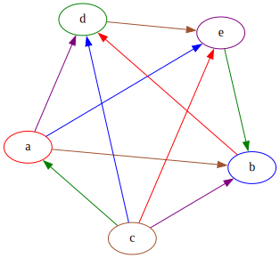
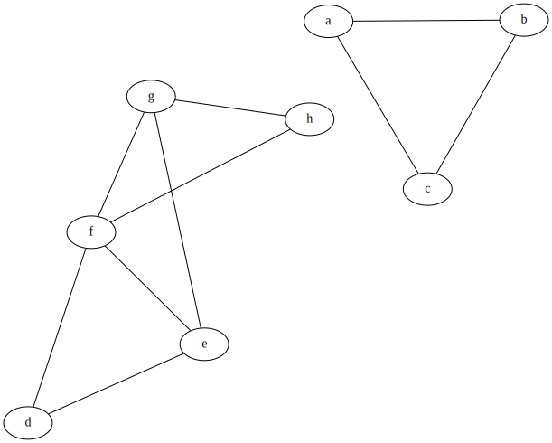
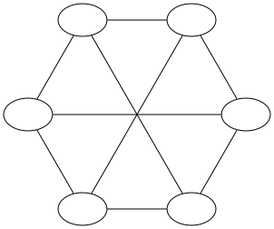
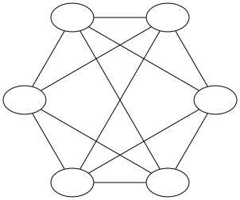

# Mathematical formulation of the problem:

Let $V$ be the set of n students.

$$V = \{v_{1}, v_{2}, v_{3} \dots v_{n}\}$$

Let $E$ be the set of matchups.

$(v_{a}, v_{b}) \in E$ means that student $v_{a}$'s paper is paired against player $v_{b}$'s paper.

$$E \subset V \times V \text{ where } \forall (v_{a}, v_{b}) \in E, v_{a} \neq v_{b}$$ 

Let $A$ the set of assignments.

$(v_{i},v_{j},v_{k}) \in A$ means that student $v_{i}$ marks the matchup $(v_{j}, v_{k}) \in E.$

$$A \subset V \times E \text{ where } \forall (v_{i},v_{j},v_{k}) \in A, v_{j} \neq v_{i} \neq v_{k}$$

Each student $v \in V$ has a score $t(v)$ that represents their score on the test.

$$t: V \rightarrow [0, 1]$$

We can define a relation $\preceq_{t}$ over $V$. 

$$\forall v, v' \in V, \quad v \preceq_{t} v' \text{ iff } t(v) \leq t(v')$$

From $A$ and $t$ we can obtain $A'$ by giving our assignments to the students.

$A'$ is similar to $A$ but the ordering of the pairs matter. In other words it turns the graph $A$ into a digraph $A'$. 

For example the triplet $(v_{i}, v_{j}, v_{k})$ means that the student determined that $v_{j}$'s paper was better than $v_{k}$'s paper, wheras the triplet $(v_{i}, v_{k}, v_{j})$ means that the student determined that $v_{k}$'s paper was better than $v_{j}$'s paper.

The correct assessment would be $(v_{i}, v_{j}, v_{k}) \text{ iff } t(v_{j}) \geq t(v_{k})$

## Our problem is as follows:

Given $V, E, A, A'$ find a relation $\preceq_{t'}$ such that the preorder defined by $\preceq_{t'}$ is 'close to' the preorder defined by $\preceq_{t}$.

## For example let's take 4 students

$$V = \{a, b, c, d\}$$

$$E = \{(a,b), (a,c), (a,d), (b,c), (b,d), (c,d)\}$$

$$
\begin{aligned}
A = \{ & (c, a, b), (d, a, b), (b, a, c), (d, a, c), \\
       & (b, a, d), (c, a, d), (a, b, c), (d, b, c), \\
       & (a, b, d), (c, b, d), (a, c, d), (b, c, d) \}
\end{aligned}
$$

$$
\begin{aligned}
& t(a) = 0.72 \\
& t(b) = 0.32 \\
& t(c) = 0.95 \\
& t(d) = 0.45 \\
\end{aligned}
$$

$$ b \preceq_{t} d \preceq_{t} a \preceq_{t} c $$

{width=80mm}

## Closeness?

In order to measure closeness between 2 preorders we'll need a distance metric. One common metric is the Kendall tau distance. This measures the number of differing pairs in the 2 preorders.

For example let's take the relations $\preceq_{t}$ and $\preceq_{t'}$ over $V = \{a, b, c, d\}$

$$ c \preceq_{t} a \preceq_{t} d \preceq_{t} b $$
$$\preceq_{t} = \{(b,d),(b,a),(b,c),(d,a),(d,c),(a,c),(a,a),(b,b),(c,c),(d,d)\}$$

$$ d \preceq_{t'} a \preceq_{t'} b \preceq_{t'} c $$
$$\preceq_{t'} = \{(c,b),(c,a),(c,d),(b,a),(b,d),(a,d),(a,a),(b,b),(c,c),(d,d)\}$$

The set of differing pairs is

$$\preceq_{t} \setminus \preceq_{t'} = \{(b,c), (d,a), (d,c), (a,c)\}$$

So the Kendall Tau distance is 
$$K_{d}(\preceq_{t}, \preceq_{t'}) = |\preceq_{t} \setminus \preceq_{t}| = 4 $$

$$|\preceq_{t} \setminus \preceq_{t'}| = |\preceq_{t'} \setminus \preceq_{t}|$$

If we let $n$ be the number of items in our preorders, and the first preorder is the reverse of the second preorder, then $\frac{n(n-1)}{2}$ is the Kendall Tau distance between them. This corresponds to the situation where all the pairs are differing. Dividing by this number will bring the Kendall tau distance into the range $[0, 1]$.

Therefore, the normalised Kendall tau distance $K_{n}$ is

$$K_{n} = \frac{K_{d}}{\frac{n(n-1)}{2}} = \frac{2K_{d}}{n(n - 1)}$$

# Choosing $A$ and $A'$

## Additional restrictions on $A$

If we're in charge of the matchup assignments then there are certain properties that we would like to satisfy. 

1. Each student does not mark their own paper.
2. Avoid giving a grader too many of a single student's matchups.
3. Keep the workload of each student fairly even.
4. We obtain a baseline amount of 'information' about each player.

### Condition 1\. 

This is already handled by the definition of $A$.

### Condition 2\. 

Let's say player 2 is assigned the matchups: (1,3), (3, 5), (3, 4) and (6, 3). In this case a lot of player 3's matches are concentrated in player 2's hands. If player 2 is a poor student then we will not have much useful information to infer player 3's skill.

### Condition 3\. 

If player 1 is assigned the matchups: 

- (2,3) 

and player 2 is assigned the matchups

- (1,4)
- (3,1)
- (5,3)
- (5,1)

Then player 2 is marking a lot more matchups that player 1 which is an unfair workload.

### Condition 4\. 

If we assume information on a student $v$ to be a measure of how many good graders have marked their matchup it becomes difficult to satisfy this. After all, how can we identify the good graders before we've ranked the students. 

If we take the grading skill out of the equation, then we can measure this by the number of times student $v$ appears in $E$. Taking this, we can satisfy this condition by constructing $E$ such that each student appears in $E$ a roughly equal amount of times.

To solve this problem of matchup assignments we can turn to a Integer Linear Programming model.

## The ILP Model for matchup distribution.

### Decision Variables

For each assignment $(i,j,k) \in A$, we define a decision variable $X_{i,j,k} \in \{0, 1\}$. 

We do not create both variables $X_{i, j, k}$ and $X_{i, k, j}$ since they represent the same assignment.

If $X_{i,j,k} = 1$ then the matchup $(j,k) \in E$ is assigned to player $i$.

If $X_{i,j,k} = 0$ then the matchup $(j,k) \in E$ is not assigned to player $i$.

### Constraints

Let's define a function $f(v)$. This takes in a student $v$ and returns the sum of all the decision variables that represents a matchup being assigned to $v$. In other words it's the total number of matchups student $v$ marks.

$$f(v) = \sum_{(j, k) \in E} X_{v, j, k}$$

To satisfy condition 3 we can add the following constraint. For every pair of students, the number of matchups assigned to them cannot differ by more than 1[^1]. 

[^1]: We don't set it equal to 0. This is because for many graphs it'll be infeasible. In fact for any graph where $|V| \mod |E| \neq 0$ it's infeasible.

$$\forall (a, b) \in V \times V, a \neq b, \quad |f(a) - f(b)| \leq 1$$

This next constraint ensures that every matchup in $E$ gets assigned. It also ensures that each matchup is marked only once. 

$$\forall (j,k) \in E, \quad \sum_{v \in V} X_{v,j,k} = 1$$

We could relax this constraint and change it to $\geq 1$ instead. This would mean that each matchup could be marked more than once. 

### Objective function

Let's define a function $s(a, b)$. This takes in 2 students $a$ and $b$, and returns the number of times a matchup containing $b$ is assigned to $a$. For example if $A = \{(a, b, c), (a, b, d), (a, f, b), (a, j, k)\}$, then $s(a, b) = 3$

$$s(a,b) = \sum_{v \in V} X_{a, b,v} + X_{a, v, b}$$

We can now define our objective function. This corresponds to condition 2 which avoids concentrating all of player $b$'s matches in the hands of player $a$.

$$\text{minimise }  max(\{s(a,b) | (a, b) \in V \times V, a \neq b\})$$

### $abs$ and $max$ in a linear program?

$abs$ and $max$ aren't linear functions so they can't be used in a linear programming model. However, there are tricks we can employ with slack variable to implement these.

Let's say we have 2 decision variables $X_{1}$ and $X_{2}$. In order to find $max(X_{1}, X_{2})$ we'll create a slack variable $M$.

Next we'll add the constraints:

$$M \geq X_{1}$$
$$M \geq X_{2}$$

$M$ will now be larger than (or equal to) $max(X_{1}, X_{2})$. However, if we minimise over $M$, then $M$ will be restricted to be equal to the value of $max(X_{1}, X_{2})$. 

In our case, the objective function becomes:

$$S = \{s(a, b) | (a, b) \in V \times V, a \neq b\}$$
$$\forall_{x \in S} \quad M \geq x$$
$$\text{minimise } M$$

To find $abs(X_{1} - X_{2})$ we'll create another slack variable $A$.

We can then add the constraints:

$$A \geq X_{1} - X_{2}$$
$$A \geq X_{2} - X_{1}$$

$A$ will be larger than (or equal to) $abs(X_{1} - X_{2})$ We can now apply the same trick as $max$. In our specific case we don't need to do that since we have the constraint $A \leq 1$.

$$ 
\begin{aligned}
\forall_{(a,b)} \in V \times V, a \neq b \quad & A_{a,b} \geq |f(a) - f(b)| \\
& A_{a,b} \geq |f(b) - f(a)| \\
& A_{a,b} \leq 1
\end{aligned}
$$

### Example:

{width=50%} 
{width=50%}
\begin{figure}[!h]
\caption{Before and after running the MIP model with 7 students}
\end{figure}

Now we can give these assignments to our students and obtain $A'$.

# Ranking methods

Now that we've obtained a set of assignments we can now get to work on defining our ranking relation $\preceq_{t'}$.

I've implemented 5 different methods of ranking:

- Borda Count 
- Weighted Borda Count
- Kemeny Score
- Bradley-Terry-Luce (BTL)
- Refereed Bradley-Terry-Luce (RBTL)

## Borda Count

With Borda count we're given a set of candidates and a set of ballots. Each ballot contains a linear ordering of the candidates. If a ballot $j$ ranks candidate $a$ over candidate $b$, then we can write $a \succ_{j} b$.

The net preference for $a$ over $b$ is defined as:

$$Net(a > b) = |\{j \in N | a \succ_{j} b\}| - \{j \in N | b \succ_{j} a\}|$$

Where $N$ is the set of ballots.

In other words, it's the total number of people that prefer $a$ over $b$, minus the total number of people that prefer $b$ to $a$. 

Next, each candidate is given a Borda score. This is calculated as:

$$Borda(x) = \sum_{y \in A} Net(x > y)$$

Where $A$ is the set of candidates.

In other words, it's the total net preference of $x$ over every other candidate $y$.

In our problem we aren't given a set of ballots. Instead we have a list of matchups forming a tournament. We can view a pair $(i, j, k) \in A'$ as a $i$'s ballot preferring candidate $j$ to candidate $k$.

Then we can iterate over every matchup to find $Net(a > b)$.

$$
j \succ_{A'_{i}} k = \begin{cases}
    1 & \text{ if } (i, j, k) \in A' \\
    -1 & \text{ if } (i, k, j) \in A' \\
    0 & \text{ otherwise}
\end{cases}
$$

$$Net_{A'}(j > k) = \sum_{i \in V} j \succ_{A'_{i}} k $$

$$Borda(j) = \sum_{k \in V} Net_{A'}(j > k)$$

In other words, if we take $A'$ to be a directed graph where if $(i, j, k) \in A'$, there's an edge $(j, k)$ and the set of nodes is $V$. Then for each node $a$ in $A'$, we $Borda(a) = outdegree(a) - indegree(a)$. 

Finally we can use $Borda(a)$ as our ranking function $t'$ to obtain a preorder $\preceq_{t'}$ over $V$.

$$a \preceq_{t'} b \text{ iff } Borda(a) \leq Borda(b)$$

### Example:

$$V = \{a, b, c, d, e\}$$

$$
A' = \{(a, c, e), (a, b, d),
       (b, a, e), (b, c, d),
       (c, a, b), (c, d, e),
       (d, c, a), (d, e, b),
       (e, a, d), (e, c, b)
       \}
$$

$$ c \succ_{A'_{a}} e = 1 \text{ since } (a, c, e) \in A' $$

$$
\begin{aligned}
Net_{A'}(a > b) =& \sum_{i \in V} a \succ_{A'_{i}} b \\
=& \, a \succ_{A'_{a}} b + a \succ_{A'_{b}} b + a \succ_{A'_{c}} b + a \succ_{A'_{d}} b + a \succ_{A'_{e}} b \\
=& \, 0 + 0 + 1 + 0 + 0 \\
=& \, 1
\end{aligned}
$$

$$
\begin{aligned}
Borda(a) =& \sum_{i \in V} Net_{A'}(a > i) \\
=& \, Net_{A'}(a > b) + Net_{A'}(a > c) + Net_{A'}(a > d) + Net_{A'}(a > e) \\
=& \, 1 + (-1) + 1 + 1 \\
=& \, 2 \\
\end{aligned}
$$

$$
\begin{aligned}
&Borda(a) = &\,2 \\
&Borda(b) = &\,{-2} \\
&Borda(c) = &\,4 \\
&Borda(d) = &\,{-2} \\
&Borda(e) = &\,{-2} \\
\end{aligned}
$$


The ranking would be $\{b, d, e\} \preceq_{t'} a \preceq_{t'} c$. 

With a low number of students ties are common, as we increase the size of $V$, we encounter ties less often. In practice we would pick an arbitrary ordering of the tied students.

{width=60mm}

## Weighted Borda Count

Weighted borda score involves weighting each decision $j \succ_{A'_{i}} k$ with the skill level of the grader $i$. In order to obtain this skill level, we must first obtain a preorder $\preceq_{t'}$ given by the borda score we just defined. Given this preorder $\preceq_{t'}$ over $V$ we can apply topological sorting on $\preceq_{t'}$ to get a total order $\prec_{t'}$. There are multiple possible total orders $\prec_{t'}$ but we pick one at random. 

Now we can define the function $idx_{\prec_{t'}} : V \rightarrow \{1, 2, \dots, n\}$. Where $n = |V|$. That maps each grader to their place in the total order.

Now for each student $v$ we can calculate a weighting value $w_{v}$.

$$w_{v} = \frac{n - idx_{\prec_{t'}}(v)}{n}$$

Finally we can define our version of the weighted borda count.

$$
j \succ_{A'_{i}} k = \begin{cases}
    w_{i} & \text{ if } (i, j, k) \in A' \\
    -w_{i} & \text{ if } (i, k, j) \in A' \\
    0 & \text{ otherwise}
\end{cases}
$$

$$Net_{A'}(j > k) = \sum_{i \in V} j \succ_{A'_{i}} k $$

$$WeightedBorda(j) = \sum_{k \in V} Net_{A'}(j > k)$$

The rationale behind this is that higher scoring students are likely to be better graders. We divide by $k$ so that the weights are in the range $[0,1]$.

### Example:

First we'll need to turn the ranking calculated from the unweighted borda count into a preorder. The ranking would be $b \prec_{t'} d \prec_{t'} e \prec_{t'} a \prec_{t'} c$. 
$$
\begin{aligned}
&w_{c} = \frac{5 - 0}{5} = 1 \\
&w_{a} = \frac{5 - 1}{5} = 0.8 \\
&w_{e} = \frac{5 - 2}{5} = 0.6 \\
&w_{d} = \frac{5 - 3}{5} = 0.4 \\
&w_{b} = \frac{5 - 4}{5} = 0.2 
\end{aligned}
$$

$$
\begin{aligned}
Net_{A'}(a > b) =& \sum_{i \in V} a \succ_{A'_{i}} b \\
=& \, a \succ_{A'_{a}} b + a \succ_{A'_{b}} b + a \succ_{A'_{c}} b + a \succ_{A'_{d}} b + a \succ_{A'_{e}} b \\
=& \, 0 + 0 + w_{c} + 0 + 0 \\
=& \, 1 
\end{aligned}
$$

$$
\begin{aligned}
WeightedBorda(a) =& \sum_{i \in V} Net_{A'}(a > i) \\
=& \, Net_{A'}(a > b) + Net_{A'}(a > c) + Net_{A'}(a > d) + Net_{A'}(a > e) \\
=& \, 1 + (-0.4) + 0.6 + 0.2 \\
=& \, 1.4 \\
\end{aligned}
$$

$$
\begin{aligned}
&WeightedBorda(a) = &1.4 \\
&WeightedBorda(b) = &1.2 \\
&WeightedBorda(c) = &2 \\
&WeightedBorda(d) = &-0.6\\
&WeightedBorda(e) = &-1.6\\
\end{aligned}
$$

Which gives us a ranking of $e \preceq_{t'} d \preceq_{t'} b \preceq_{t'} a \preceq_{t'} c$

With the weighted borda count it's still possible to achieve ties, however it's less likely.

## Kemeny Score

Like the Borda score, the Kemeny score is defined over a set of candidates and a set of ballots.

We first enumerate over the ballots to create a matrix $B$ that counts voter pairwise preferences. For example, entry $B_{i,j}$ would contain the total number of ballots that prefer candidate $i$ to candidate $j$.

Next we test all possible rankings and calculate a score for each ranking. This ranking is calculated as follows:

$$Kemeny(\preceq_{t'}, B) = \sum_{(i, j) \in \preceq_{t'}} B_{i,j} - B_{j,i}$$

One way to think about it is that it's calculating the Kendall tau distance between a ranking $\preceq_{t'}$ and the aggregated ballots. 

In our case we don't have ballots, but we do have the pairwise comparisons needed to create the matrix. We reuse the $Net$ operation we defined for the (unweighted) Borda count to perform the same operation.

$$Kemeny(\preceq_{t'}, A') = \sum_{(i, j) \in \preceq_{t'}} Net_{A'}(i > j) - Net_{A'}(j > i)$$

Next we have to enumerate through all possible rankings to find the ranking that minimises the Kemeny score. That ranking will be the Kemeny ranking. However, now we have a problem there are $n!$ possible rankings (where $n$ is the length of the ranking). As $n$ grows larger this will be computationally intractable.

Instead of doing an exhaustive search we can use local search with a metaheuristic to find an approximate solution. In my case I used simulated annealing which we'll talk about later.

Either way, once we compute the Kemeny ranking we can use it as a preorder over $V$ and use it as our ranking $\preceq_{t'}$.

## Bradley-Terry-Luce (BTL)

Under the Bradley-Terry-Luce (BTL) model, the probability of a student $a$ beating student $b$ is:

$$P(a > b) = \frac{1}{1 + e^{-(w_{a} - w_{b})}}$$

Where $w_{a}$ and $w_{b}$ are the skill levels of $a$ and $b$.

If we assume that all matches are independent, then given a set of matches $A'$ we can multiply them together to get the probability of the tournament happening. This will also be our likelihood function $\mathcal{L}(\theta)$. Where $\theta = (w_{a}, w_{b}, \dots)$. $\Theta$ is the parameter space which contains all possible values for $\theta$.

$$\mathcal{L}(\theta) = \prod_{(i, j, k) \in A'} \frac{1}{1 + e^{-(w_{j} - w_{k})}}$$

Our next step will involve finding the values of $\theta$ that maximise $\mathcal{L}(\theta)$. This will return a list of skill values $(w_{a}, w_{b}, \dots)$ that we can use as our ranking function $t'$.

In practice we can actually take the log of the likelihood function to make it easier to maximise.

$$\mathcal{L}(\theta) = \sum_{(i,j,k) \in A'} -\ln(1 + e^{-(w_{i} - w_{j})})$$

So to put it all together:

$$\hat{\theta} = \argmax_{\theta \in \Theta} \mathcal{L}(\theta)$$
$$a \preceq_{t'} b \text{ iff } w_{a}^{\hat{\theta}} \leq w_{b}^{\hat{\theta}}$$

Note that method and all of the previous methods (barring weighted borda) doesn't take into account who's grading the matchups. We'll rectify that in the next ranking method.

## Refereed Bradley-Terry-Luce (RBTL)

The RBTL model is very similar to the BTL model with one small difference. Instead of taking pairwise matchups, we also take into the account the grader. So the probability of student $j$ beating student $k$ with student $i$ grading the matchup is:

$$P(i : j > k) = \frac{1}{1+e^{-g_{i}(w_{j} - w_{k})}} \text{ where } g_{i} = aw_{i} + b$$

Where $a$ and $b$ are parameters that determine the relationship between student skill and grading skill.

We can now apply the same steps as the BTL model to obtain a ranking $\preceq_{t'}$.

$$\mathcal{L}(\theta, a, b) = \sum_{(i,j,k) \in A'} -\ln(1 + e^{(aw_{i} + b)(w_{j} - w_{k})})$$
$$\hat{\theta} = \argmax_{\theta \in \Theta, a,b \in \mathbb{R}} \mathcal{L}(\theta)$$
$$a \preceq_{t'} b \text{ iff } w_{a}^{\hat{\theta}} \leq w_{b}^{\hat{\theta}}$$

# Iterative Ranking

In the first method we distribute all the matchups at once, obtain the entire tournament $A'$ and perform our ranking methods. What if instead we incrementally built up $A'$ in stages and used the incomplete information to distribute matchups in such a way that maximises information.

Here I'll outline the basic steps of our iterative matchup distribution algorithm. 

1. Distribute the a set of matchups. Each student will be given 1 matchup to mark. If this is the first pass, use the non-iterative matchup distribution algorithm. Otherwise, use the Iterative version.
2. Rank the students using one of the ranking methods E.g. RBTL, Kemeny...
3. Calculate a score for the skill of the student, based on the ranking.
4. For the next set of matchups, calculate an uncertainty score for each matchup.
5. Pair up the most skilled players with the most uncertain matchups, while keeping the other constraints in play.
6. Until we've distributed the desired amount of matchups, return to step 1.

One thing to note is that in the first pass, we need to produce a ranking with only $n$ matchups, where $n$ is the number of students. 

However in order to obtain a ranking of the students we need every student to be represented in this set of matchups. If we didn't have this, then we wouldn't have any information on students that weren't included.

This will correspond to a graph (the set of matchups in step 1) in which every node has at least one edge. Another property we'll want is for it to be connected. This would mean that there are no isolated subgraphs where we can't get an effective comparison to the main cohort. We'll talk about the generation of this graph in a later section.

{width=50mm}

## Skill and uncertainty

In steps 3 and 4 we estimate skill for players and uncertainty for matchups based on the ranking.

For skill $w$ we can reuse the definition from the weighted borda count.

$$w_{v} = \frac{n - idx_{\prec_{t'}}(v)}{n}$$

For uncertainty $u$ we could define it like this:

$$u_{a,b} = \frac{|idx_{\prec_{t'}}(a) - idx_{\prec_{t'}}(b)|}{n}$$

This ensures that matchups that are close together (even matches) have a uncertainty score, and matchups that are far apart (one-sided matches) are given a high uncertainty score.

## The iterative matchup distribution ILP model

For the ILP model we can reuse the decision variables and constraints from the non-iterative model.

For each assignment $(i,j,k) \in A$, we define a decision variable $X_{i,j,k} \in \{0, 1\}$.

If $X_{i,j,k} = 1$ then the matchup $(j,k) \in E$ is assigned to player $i$.

If $X_{i,j,k} = 0$ then the matchup $(j,k) \in E$ is not assigned to player $i$.

$$f(v) = \sum_{(j, k) \in E} X_{v, j, k}$$

$$\forall (a, b) \in V \times V, a \neq b, \quad |f(a) - f(b)| \leq 1$$

$$\forall (j,k) \in E, \quad \sum_{v \in V} X_{v,j,k} = 1$$

For the objective function we'll want the best players to be assigned the most uncertain matchups.

$|w - u|$ will contain the distance between the skill and uncertainty. By minimising this number we'll be assigning the best players to the most uncertain matches.

$$\text{ minimise} \sum_{(i,j,k) \in A} X_{i,j,k} \cdot |w_{i} - u_{j,k}|$$

One thing to note is that each time this is ran, it'll have no memory of the previous passes. Therefore, it may give out duplicate assignments. In order to avoid this, we'll store all previous assignments and prevent those decision variables from being created.

### Side note: Brute force solution 

A cycle graph, has a simple structure. A valid assignment of graph, without taking into account conditions 2, 3 and 4 from ['Additional restrictions on $A$'](#Additional restrictions on $A$), is a graph in which each edge is labelled. 

The set of labels is the same as the set of vertices $V$. Each label must be used once, and if an edge is incident to a vertex $v$, then the edge cannot be labelled with $v$.

For a cycle graph, the number of possible assignments of students can be described by the number of permutations $s$ of the sequence $0, 1, \dots n - 1$, such that $s[i] \neq i$ and $s[i] \neq i + 1 \mod n$ for all $i$.

This is described by:

$$A_{n} = \sum_{k = 0}^{n} (-1)^k \frac{2n}{2n - k}\binom{2n - k}{k} (n - k)!$$
<!-- https://oeis.org/A000179 -->

Which blows up very quickly. So to conclude, we cannot enumerate through all possible solutions.

# Implementation details

## Calculating Kemeny ranking - Simulated annealing

Calculating the optimal Kemeny ranking is NP-Hard and as the number of students increases it become more difficult to find the solution.

Therefore, we employ an approximation algorithm called Simulated annealing - a local search algorithm.

It takes in 4 hyper parameters:

- Temperature Length (TL)
- Initial Temperature (TI)
- Cooling Function (C)
- Stopping Condition (S)

As with local search algorithms, we need a neighbourhood function $neigh$. In our case it'll be swapping 2 adjacent players in the ranking. Using the right data structures, this will be calculated in $O(1)$ time.

We'll also need an objective function that we're optimising. In our case, this will be the kemeny score.

The algorithm is as follows:

```
define simulated_annealing(TL, TI, C, S, neigh, init_sol, obj) {
    curr_sol = init_sol
    best_sol = init_sol
    best_cost = obj(init_sol)
    temp = TI
    iterations = 0
    while not S(iterations) 
    {
        for i = 1 to TL 
        {
           temp_sol = neigh(curr_sol)
           temp_cost = obj(temp_sol)
           curr_cost = obj(curr_sol)
           cost_diff = temp_cost - curr_cost
           if cost_diff <= 0 
           {
                if temp_cost < best_cost {
                    # The neighbour is better than
                    # the best solution we've found so far
                    best_sol = temp_sol
                    best_cost = temp_cost
                }
                curr_sol = temp_sol
           }
           else
           {
                # The neighbour is worse so we generate a random number
                # and see if it's larger than the value of p.
                # p increases as temperature increases,
                # so we make less uphill moves over time
                q = random(0,1)
                p = e^(-cost_diff/temp)
                if q < p {
                    curr_sol = temp_sol
                }
           }
        }
        iterations += 1
        temp = C(temp)
    }
    return best_sol
}
```

One thing to note is that the stopping condition here is given as a function of iterations. In practice, we can use other stopping conditions.
Also for efficiency we calculate the value of `curr_cost` based on `neigh(curr_sol)` instead of recalculating from scratch.

## The size of $A$

As we increase the size of $A$, the workload of the students also increases. We want to strike a balance between obtaining more information to obtain an accurate ranking and not overburdening our students with too much work.

The total number of pairs that each player is $\binom{n}{2} = \frac{1}{2} n(n - 1)$. This scales quadratically, so if we gave every pair to every student. Then as the number of students increases, it'll quickly become infeasible to mark them all.

However, if we divide all the matchups along all the students, the number of matchups will scale linearly. Of course this means we'll receive less information.

| Number of students | $\binom{n}{2}$ | $\binom{n}{2} \div n$   |
|--------------------|----------------|--------------------------|
| 5                  | 10             | 2                        |
| 10                 | 45             | 4.5                      |
| 15                 | 105            | 7                        |
| 20                 | 190            | 9.5                      |
| 25                 | 300            | 12                       |
| 30                 | 435            | 14.5                     |

As we increase our class size to numbers seen in MOOCs, even linear scaling will be intractable. In these cases, we'll need to make a judgement call and cap the number of matchups assigned to players at the cost of calculating a worse ranking.

## Generating $A$

### Non-Iterative

For the non-iterative algorithm we want to generate a graph $G = (V, E), \, A \subset V \times E$.

We want to 

1. Control the number of nodes.
2. Control the number of edges.
3. Have it be connected.
4. Keep the degrees of each node relatively equal.

Condition 1 is necessary because we want have a graph that includes every student.

Condition 2 is there because we want to be able to control the number of papers each student has to mark. 

Condition 3 is required to enusre that we don't have isolated subgraphs where we can't compare students to the main cohort.

Condition 4 is needed to ensure the information gleamed from each student isn't unbalanced.

One method that fulfils 3 of these conditions is to generate a connected $k$-regular graph.

### Connected $k$-regular graph generation 

A $k$-regular graph is a graph in which every node has the same number of neighbours. 

Given $n$ nodes, a $k$-regular graph only exists if $kn$ is even and $n \geq k + 1$. 

<!-- https://math.stackexchange.com/questions/142112/how-to-construct-a-k-regular-graph -->
An algorithm to generate a $k$-regular graph is as follows:

1. Lay out all your nodes in a circle
2. If $k = 2m$ is even, then connect each node to it's nearest $m$ neighbours
3. else if  $k = 2m + 1$ is odd, then connect each node to it's nearest $m$ neighbours and it's opposite vertex.

{width=50%}
{width=50%}
\begin{figure}[!h]
\caption{$k=3, n=6$ on the left, $k=4, n=6$ on the right}
\end{figure}


If $k \geq 2$, then for each node will be connected to it's nearest 2 neighbours. Therefore for every graph where $k \geq 2$ generated with this method will have a cycle as a subgraph, and will be connected, satisfying condition 3.

Condition 4 is fulfilled, since every node has the same degree and condition 1 is easy since we can just choose $n$.

Condition 2 is a bit tricky. Every $k$-regular graph has $nk/2$ edges. Since $|E| = nk/2$, if we have $n$ students and we want $n k_{1} < r < n k_{2}$ edges, then it's impossible. $|E|$ must be a multiple of $k/2$.

### Iterative

# Evaluation

# TODO: Synthetic data generation of $A'$/Something to think about

In our first model of students grading, we assumed that marking skill was a function of player skill.
Specifically grading\_skill = 0.5 * player\_skill + 0.5
This is a mapping from [0, 1] to [0.5, 1]. This assumes that players with a score of 0 are purely guessing.

However, let's take a maths exam. If a player got 0% on the exam, and was 100% confident in their answers, and each question was multiple choice. Then they would always mark the matchup incorrectly. In this case grading\_skill = player\_skill.

But what about a non-objective marking. For example a history essay. In this case would we keep the same model? Would the student guess?

Also would a student who got 0% on a maths exam be 100% confident on their paper?

Maybe we could have some sort of in-between? I.e. mapping [0 - 1] to [0.2 - 1]?

Given (A, B, C). Could the probability depend on the difference between B's and C's score?

Actually, we already have a probablility function P(C: A > B). that we define in the paper! Is it cheating if we use it though? It feels like we're giving an unfair advantage to RBTL in that case since the model exactly fits the dataset.

## Ideas for turning it into a website?

Little about section with explanation + link to repo + paper 

Main section will have 2 options:

- Full thing w/ paper distribution
- Little DSL that lets you input pairs and gives you a ranking approximation

HTMX for the frontend.
FastAPI for the backed.
