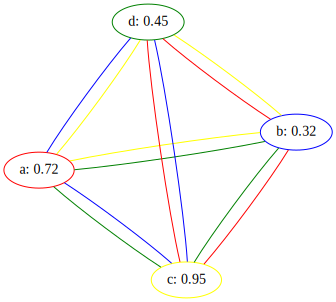
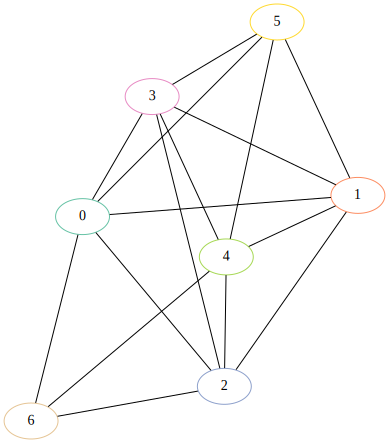
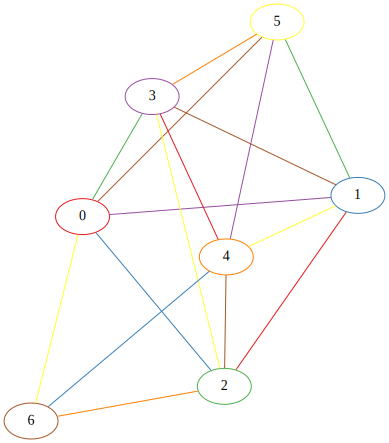

# Mathematical formulation of the problem:

Let $V$ be the set of n students.

$$V = \{v_{1}, v_{2}, v_{3} \dots v_{n}\}$$

Let $E$ be the set of matchups.

$(v_{a}, v_{b}) \in E$ means that student $v_{a}$'s paper is paired against player $v_{b}$'s paper.

$$E \subset V \times V \text{ where } \forall (v_{a}, v_{b}) \in E, v_{a} \neq v_{b}$$ 

Let $A$ the set of assignments.

$(v_{i},v_{j},v_{k}) \in A$ means that student $v_{i}$ marks the matchup $(v_{j}, v_{k}) \in E.$

$$A \subset E \times V \text{ where } \forall (v_{i},v_{j},v_{k}) \in A, v_{j} \neq v_{i} \neq v_{k}$$

Each student $v \in V$ has a score $t(v)$ that reprsents their score on the test.

$$t: V \rightarrow [0, 1]$$

We can define a relation $\preceq_{t}$ over $V$. 

$$\forall v, v' \in V, \quad v \preceq_{t} v' \text{ iff } t(v) \leq t(v')$$

From $A$ and $t$ we can obtain $A'$ by giving our assignments to the students.

$A'$ is similar to $A$ but the ordering of the pairs matter. In other words it turns the graph $A$ into a digraph $A'$. 

For example the triplet $(v_{i}, v_{j}, v_{k})$ means that the student determined that $v_{j}$'s paper was better than $v_{k}$'s paper, wheras the triplet $(v_{i}, v_{k}, v_{j})$ means that the student determined that $v_{k}$'s paper was better than $v_{j}$'s paper.

The correct assessment would be $(v_{i}, v_{j}, v_{k}) \text{ iff } t(v_{j}) \geq t(v_{k})$

## Our problem is as follows:

Given $V, E, A, A'$ find a relation $\preceq_{t'}$ such that the preorder defined by $\preceq_{t'}$ is 'close to' the preorder defined by $\preceq_{t}$.

## For example let's take 4 students

$$V = \{a, b, c, d\}$$

$$E = \{(a,b), (a,c), (a,d), (b,c), (b,d), (c,d)\}$$

$$
\begin{aligned}
A = \{ & (c, a, b), (d, a, b), (b, a, c), (d, a, c), \\
       & (b, a, d), (c, a, d), (a, b, c), (d, b, c), \\
       & (a, b, d), (c, b, d), (a, c, d), (b, c, d) \}
\end{aligned}
$$

$$
\begin{aligned}
& t(a) = 0.72 \\
& t(b) = 0.32 \\
& t(c) = 0.95 \\
& t(d) = 0.45 \\
\end{aligned}
$$

$$ b \preceq_{t} d \preceq_{t} a \preceq_{t} c $$

{width=80mm}

## Closeness?

In order to measure closeness between 2 preorders we'll need a distance metric. One common metric is the Kendall tau distance. This measures the number of differing pairs in the 2 preorders.

For example let's take the relations $\preceq_{t}$ and $\preceq_{t'}$ over $V = \{a, b, c\}$

$$ c \preceq_{t} a \preceq_{t} d \preceq_{t} b $$
$$\preceq_{t} = \{(b,d),(b,a),(b,c),(d,a),(d,c),(a,c),(a,a),(b,b),(c,c),(d,d)\}$$

$$ d \preceq_{t'} a \preceq_{t'} b \preceq_{t'} c $$
$$\preceq_{t'} = \{(c,b),(c,a),(c,d),(b,a),(b,d),(a,d),(a,a),(b,b),(c,c),(d,d)\}$$

The set of differing pairs is

$$\preceq_{t} \setminus \preceq_{t'} = \{(b,c), (d,a), (d,c), (a,c)\}$$

So the Kendall Tau distance is 
$$K_{d}(\preceq_{t}, \preceq_{t'}) = |\preceq_{t} \setminus \preceq_{t}| = 4 $$

$$|\preceq_{t} \setminus \preceq_{t'}| = |\preceq_{t'} \setminus \preceq_{t}|$$

If we let $n$ be the number of items in our preorders, and the first preorder is the reverse of the second preorder, then $\frac{n(n-1)}{2}$ is the Kendall Tau distance between them. This corresponds to the situation where all the pairs are differing.

Therefore, the normalised Kendall tau distance $K_{n}$ is

$$K_{n} = \frac{K_{d}}{\frac{n(n-1)}{2}} = \frac{2K_{d}}{n(n - 1)}$$

# Choosing $A$ and $A'$

## TODO: The size of $A$

In the example given we've...

Talk about workload, growth rate of giving out all pairs, what about with repeats etc...

Maybe could move this section over into experimental bit. Coz we could talk about accuracy as we change the size of A

## Additional restrictions on $A$

If we're in charge of the matchup assignments then there are certain properties that we would like to satisfy. 

1. Each student does not mark their own paper.
2. Avoid giving a grader too many of a single student's matchups.
3. Keep the workload of each student fairly even.
4. We obtain a baseline amount of 'information' about each player.

### Condition 1\. 

This is already handled by the definition of $A$.

### Condition 2\. 

Let's say player 2 is assigned the matchups: (1,3), (3, 5), (3, 4) and (6, 3). In this case a lot of player 3's matches are concentrated in player 2's hands. If player 2 is a poor student then we will not have much useful information to infer player 3's skill.

### Condition 3\. 

If player 1 is assigned the matchups: 

- (2,3) 

and player 2 is assigned the matchups

- (1,4)
- (3,1)
- (5,3)
- (5,1)

Then player 2 is marking a lot more matchups that player 1 which is an unfair workload.

### Condition 4\. 

If we assume information on a student $v$ to be a measure of how many good graders have marked their matchup it becomes difficult to satisfy this. After all, how can we identify the good graders before we've ranked the students. 

If we take the grading skill out of the equation, then we can measure this by the number of times student $v$ appears in $E$. Taking this, we can satisfy this condition by constructing $E$ such that each student appears in $E$ a roughly equal amount of times.

To solve this problem of matchup assignments we can turn to a Mixed Integer Linear Programming model.

## The MILP Model for paper distribution.

### Decision Variables

For each assignment $(i,j,k) \in A$, we define a decision variable $X_{i,j,k} \in \{0, 1\}$.

If $X_{i,j,k} = 1$ then the matchup $(j,k) \in E$ is assigned to player $i$.

If $X_{i,j,k} = 0$ then the matchup $(j,k) \in E$ is not assigned to player $i$.

### Constraints

Let's define a function $f(v)$. This takes in a student $v$ and returns the sum of all the decision variables that represents a matchup being assigned to $v$. In other words it's the total number of matchups student $v$ marks.

$$f(v) = \sum_{(j, k) \in E} X_{v, j, k}$$

To satisfy condition 3 we can add the following constraint. For every pair of students, the number of matchups assigned to them cannot differ by more than 1[^1]. 

[^1]: We don't set it equal to 0. This is because for many graphs it'll be infeasible. In fact for any graph where $|V| \mod |E| \neq 0$ it's infeasible.

$$\forall (a, b) \in V \times V, a \neq b, \quad |f(a) - f(b)| \leq 1$$

This next constraint ensures that every matchup in $E$ gets assigned. It also ensures that each matchup is marked only once. We could relax this constraint and change it to $\geq 1$ instead. This would mean that each matchup could be marked more than once.

$$\forall (j,k) \in E, \quad \sum_{v \in V} X_{v,j,k} = 1$$

### Objective function

Let's define a function $s(a, b)$. This takes in 2 students $a$ and $b$, and returns the number of times a matchup containing $b$ is assigned to $a$. For example if $A = \{(a, b, c), (a, b, d), (a, f, b), (a, j, k)\}$, then $s(a, b) = 3$

$$s(a,b) = \sum_{v \in V} X_{a, b,v} + X_{a, v, b}$$

We can now define our objective function. This corresponds to condition 2 which avoids concentrating all of player $b$'s matches in the hands of player $a$.

$$\text{minimise }  max(\{s(a,b) | (a, b) \in V \times V, a \neq b\})$$

### $abs$ and $max$ in a linear program?

$abs$ and $max$ aren't linear functions so they can't be used in a linear programming model. However, there are tricks we can employ with slack variable to implement these.

Let's say we have 2 decision variables $X_{1}$ and $X_{2}$. In order to find $max(X_{1}, X_{2})$ we'll create a slack variable $M$.

Next we'll add the constraints:

$$M \geq X_{1}$$
$$M \geq X_{2}$$

$M$ will now be larger than (or equal to) $max(X_{1}, X_{2})$. However, if we minimise over $M$, then $M$ will be restricted to be equal to the value of $max(X_{1}, X_{2})$. 

To find $abs(X_{1}, X_{2})$ we'll create another slack variable $A$.

We can then add the constraints:

$$A \geq X_{1} - X_{2}$$
$$A \geq X_{2} - X_{1}$$

$A$ will be larger than (or equal to) $abs(X_{1}, X_{2})$ We can now apply the same trick as $max$. In our specific case we don't need to do that since we have the constraint $A \leq 1$.

### Example:

{width=50%} 
{width=50%}
\begin{figure}[!h]
\caption{Before and after running the MIP model with 7 students}
\end{figure}

Now we can give these assignments to our students and obtain $A'$.

# TODO: Ranking methods

Now that we've obtained a set of assignments we can now get to work on defining our ranking relation $\preceq_{t'}$.

I've implemented 5 different methods of ranking:

- Borda Count 
- Weighted Borda Count
- Kemeny Score
- Bradley-Terry-Luce (BTL) IDEA!
- Refereed Bradley-Terry-Luce (RBTL)

## Borda Count

With Borda count we're given a set of candidates and a set of ballots. Each ballot contains a linear ordering of the candidates. If a ballot $j$ ranks candidate $a$ over candidate $b$, then we can write $a \succ_{j} b$.

The net preference for $a$ over $b$ is defined as:

$$Net(a > b) = |\{j \in N | a \succ_{j} b\}| - \{j \in N | b \succ_{j} a\}|$$

Where $N$ is the set of ballots.

In other words, it's the total number of people that prefer $a$ over $b$, minus the total number of people that prefer $b$ to $a$. 

Next, each candidate is given a Borda score. This is calculated as:

$$Borda(x) = \sum_{y \in A} Net(x > y)$$

Where $A$ is the set of candidates.

In other words, it's the total net preference of $x$ over every other candidate $y$.

In our problem we aren't given a set of ballots. Instead we have a list of matchups forming a tournament. We can view a pair $(i, j, k) \in A'$ as a $i$'s ballot preferring candidate $j$ to candidate $k$.

Then we can enumerate over every student's matchup to find $Net(a > b)$.

$$
j \succ_{A'_{i}} k = \begin{cases}
    1 & \text{ if } (i, j, k) \in A' \\
    -1 & \text{ if } (i, k, j) \in A' \\
    0 & \text{ otherwise}
\end{cases}
$$

$$Net(j > k) = \sum_{i \in V} j \succ_{A'_{i}} k $$

$$Borda(j) = \sum_{k \in V} Net(j > k)$$

In other words, if we take $A'$ to be a directed graph where if $(i, j, k) \in A'$, there's an edge $(j, k)$ and the set of nodes is $V$. Then for each node $a$ in $A'$, we $Borda(a) = indegree(a) - outdegree(a)$. 

Finally we can use $Borda(a)$ as our ranking function $t'$ to obtain a preorder $\preceq_{t'}$ over $V$.

$$a \preceq_{t'} b \text{ iff } Borda(a) \leq Borda(b)$$

## Weighted Borda Count:TODO

Given a preorder $\preceq_{t'}$ over $V$ we can define an accuracy weighting $w$ for each student $v \in V$.

$$n = |V|$$
$$k = \frac{n(n + 1)}{2}$$
$$w_{v} = \frac{n - idx(v)}{k}$$

How to express idx as maths?

## Kemeny Score

Like the Borda score, the Kemeny score is defined over a set of candidates and a set of ballots.

We first enumerate over the ballots to create a matrix $B$ that counts voter pairwise preferences. For example, entry $B_{i,j}$ would contain the total number of ballots that prefer candidate $i$ to candidate $j$.

Next we test all possible rankings and calculate a score for each ranking. This ranking is calculated as follows:

$$Kemeny(\preceq_{t'}, B) = \sum_{(i, j) \in \preceq_{t'}} B_{i,j} - B_{j,i}$$

One way to think about it is that it's calculating the Kendall tau distance between a ranking $\preceq_{t'}$ and the aggregated ballots. 

In our case we don't have ballots, but we do have the pairwise comparisons needed to create the matrix. We reuse the $Net$ operation we defined for the Borda count to perform the same operation.

$$Kemeny(\preceq_{t'}, B) = \sum_{(i, j) \in \preceq_{t'}} Net(i > j) - Net(j > i)$$

Next we have to enumerate through all possible rankings to find the ranking that minimises the Kemeny score. That ranking will be the Kemeny ranking. However, now we have a problem there are $n!$ possible rankings (where $n$ is the length of the ranking). As $n$ grows larger this will be computationally intractable.

Instead of doing an exhaustive search we can use local search with a metaheuristic to find an approximate solution. In my case I used simulated annealing which we'll talk about later.

Either way, once compute the Kemeny ranking we can use it as a total order over $V$ and use it as our ranking $\preceq_{t'}$.

## Bradley-Terry-Luce (BTL)

Under the Bradley-Terry-Luce (BTL) model, the probability of a student $a$ beating student $b$ is as follows:

$$P(a > b) = \frac{1}{1 + e^{-(w_{a} - w_{b})}}$$

Where $w_{a}$ and $w_{b}$ are the skill levels of $a$ and $b$.

If we assume that all matches are independent, then given a set of matches $A'$ we can multiply them together to get the probability of the tournament happening. This will also be our likelihood function $\mathcal{L}(\theta)$. Where $\theta = (w_{a}, w_{b}, \dots)$. $\Theta$ is the parameter space which contains all possible values for $\theta$.

$$\mathcal{L}(\theta) = \prod_{(i, j, k) \in A'} \frac{1}{1 + e^{-(w_{j} - w_{k})}}$$

Our next step will involve finding the values of $\theta$ that maximuse $\mathcal{L}(\theta)$. This will return a list of skill values $(w_{a}, w_{b}, \dots)$ that we can use as our ranking function $t'$.

In practice we can actually take the log of the likelihood function to make it easier to maximise.

$$\mathcal{L}(\theta) = \sum_{(i,j,k) \in A'} -ln(1 + e^{-(w_{i} - w_{j})})$$

So to put it all together:

$$\hat{\theta} = \argmax_{\theta \in \Theta} \mathcal{L}(\theta)$$
$$a \preceq_{t'} b \text{ iff } w_{a}^{\hat{\theta}} \leq w_{b}^{\hat{\theta}}$$

Note that method and all of the previous methods (barring weighted borda) doesn't take into account who's grading the matchups. We'll rectify that in the next ranking method.

## Refereed Bradley-Terry-Luce (RBTL)

The RBTL model is very similar to the BTL model with one small difference. Instead of taking pairwise matchups, we also take into the account the grader. So the probability of student $j$ beating student $k$ with student $i$ grading the matchup is:

$$P(i : j > k) = \frac{1}{1+e^{-g_{i}(w_{j} - w_{k})}} \text{ where } g_{i} = aw_{i} + b$$

Where $a$ and $b$ are parameters that determine the relationship between student skill and grading skill.

We can now apply the same steps as the BTL model to obtain a ranking $\preceq_{t'}$.

$$\mathcal{L}(\theta, a, b) = \sum_{(i,j,k) \in A'} -ln(1 + e^{(aw_{i} + b)(w_{j} - w_{k})})$$
$$\hat{\theta} = \argmax_{\theta \in \Theta, a,b \in \mathbb{R}} \mathcal{L}(\theta)$$
$$a \preceq_{t'} b \text{ iff } w_{a}^{\hat{\theta}} \leq w_{b}^{\hat{\theta}}$$

# TODO: Synthetic data generation of $A'$/Something to think about

In our first model of students grading, we assumed that marking skill was a function of player skill.
Specifically grading\_skill = 0.5 * player\_skill + 0.5
This is a mapping from [0, 1] to [0.5, 1]. This assumes that players with a score of 0 are purely guessing.

However, let's take a maths exam. If a player got 0% on the exam, and was 100% confident in their answers, and each question was multiple choice. Then they would always mark the matchup incorrectly. In this case grading\_skill = player\_skill.

But what about a non-objective marking. For example a history essay. In this case would we keep the same model? Would the student guess?

Also would a student who got 0% on a maths exam be 100% confident on their paper?

Maybe we could have some sort of in-between? I.e. mapping [0 - 1] to [0.2 - 1]?

Given (A, B, C). Could the probability depend on the difference between B's and C's score?

Actually, we already have a probablility function P(C: A > B). that we define in the paper! Is it cheating if we use it though? It feels like we're giving an unfair advantage to RBTL in that case since the model exactly fits the dataset.

## Ideas for turning it into a website?

Little about section with explanation + link to repo + paper 

Main section will have 2 options:

- Full thing w/ paper distribution
- Little DSL that lets you input pairs and gives you a ranking approximation

HTMX for the frontend.
FastAPI for the backed.
